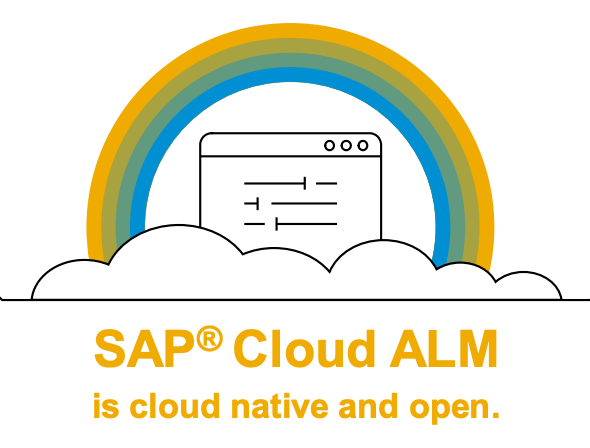

# IIS162 - Manage Your Implementation Using SAP Cloud ALM

## Description

This repository contains the material for the SAP TechEd 2021 session called "IIS162 - Manage Your Implementation Using SAP Cloud ALM".  

## Overview

### Good day!

In this session you experience how SAP Cloud ALM can help you adoption the Intelligent Enterprise and accelerating your implementation projects.

You will perform the whole roundtrip from with setting up your implementation project to project reporting and traceability. On this journey, you will be introduced to the most important SAP Cloud ALM concepts such as Projects, Processes, Tasks, Requirements, Test Cases, Features. 

You will also notice that now you can execute multiple projects in parallel and perform mass uploads and downloads You will experience that how a guided approach always helps you understand what to do next. For this session you will have the dual role of a Project lead and a Business Process Expert

Now you can get started. We hope you enjoy the session.

​Cheers, Your SAP Cloud ALM team

## Requirements

You need is a modern browser to work with the tool. Additionally, you need sweets/fruits and water to stay nice and hydrated.

## Exercises

- [Getting Started](exercises/ex0/)
    - [Access SAP Cloud ALM SAP TechEd tenant](exercises/ex1#exercise-11-sub-exercise-1-description)
    - [User, Password, and Naming Conventions](exercises/ex1#exercise-11-sub-exercise-1-description)
- [Exercise 1 - Project Setup](exercises/ex1/)
    - [Select Project Template and Define Timeboxes/Sprints](exercises/ex1/README.md#Select-Project-Template-and-Define-Timeboxes/Sprints)
    - [Create Teams and Assign Persons](exercises/ex1/README.md#Create-Teams-and-Assign-Persons)
- [Exercise 2 - Document Custom Processes](exercises/ex2/)
    - [Create Custom Solution Process](exercises/ex2/README.md#exercise-21-sub-exercise-1-description)
    - [Model Your Process Diagrams](exercises/ex2#exercise-21-sub-exercise-1-description)
    - [Activate Your Custom Solution Processes](exercises/ex2#exercise-21-sub-exercise-1-description)
- [Exercise 3 - Define the Project Process Scope](exercises/ex3/)
    - [Create a Scope](exercises/ex2#exercise-21-sub-exercise-1-description)
    - [Pull Solution Processes into scope](exercises/ex2#exercise-21-sub-exercise-1-description)
    - [Review Project Process Scope](exercises/ex2#exercise-21-sub-exercise-1-description)
- [Exercise 4 - Determinde the Project Implementation Scope](exercises/ex4/)
    - [Fit-to-Standard Workshops](exercises/ex2#exercise-21-sub-exercise-1-description)
    - [Capture Requirements](exercises/ex2#exercise-21-sub-exercise-1-description)
- [Exercise 5 - Manage Requirements Realization](exercises/ex5/)
    - [Break Requirements into User Stories](exercises/ex2#exercise-21-sub-exercise-1-description)
    - [Approve Requirement](exercises/ex2#exercise-21-sub-exercise-1-description)
- [Exercise 6 - Manage Tests](exercises/ex6/)
    - [Create Test Case](exercises/ex2#exercise-21-sub-exercise-1-description)
    - [Test Execution](exercises/ex2#exercise-21-sub-exercise-1-description)
- [Exercise 7 - Manage Deployments](exercises/ex7/)
    - [Create Feature](exercises/ex2#exercise-21-sub-exercise-1-description)
    - [Assign Transports](exercises/ex2#exercise-21-sub-exercise-1-description)
    - [Release and Deploy Feature](exercises/ex2#exercise-21-sub-exercise-1-description)
    - [Review Deployment History](exercises/ex2#exercise-21-sub-exercise-1-description)
- [Exercise 8 - Project Overview and Traceability](exercises/ex8/)
    - [Overview Page](exercises/ex2#exercise-21-sub-exercise-1-description)
    - [Process Traceability](exercises/ex2#exercise-21-sub-exercise-1-description)
    - [Requirement Traceability](exercises/ex2#exercise-21-sub-exercise-1-description)
- [Exercise 9 - Conclude and Hide Your Project](exercises/ex9/)    

## How to obtain support

Support for the content in this repository is available during the actual time of the online session for which this content has been designed. Otherwise, you may request support via the [Issues](../../issues) tab.

## License
Copyright (c) 2021 SAP SE or an SAP affiliate company. All rights reserved. This project is licensed under the Apache Software License, version 2.0 except as noted otherwise in the [LICENSE](LICENSES/Apache-2.0.txt) file.
