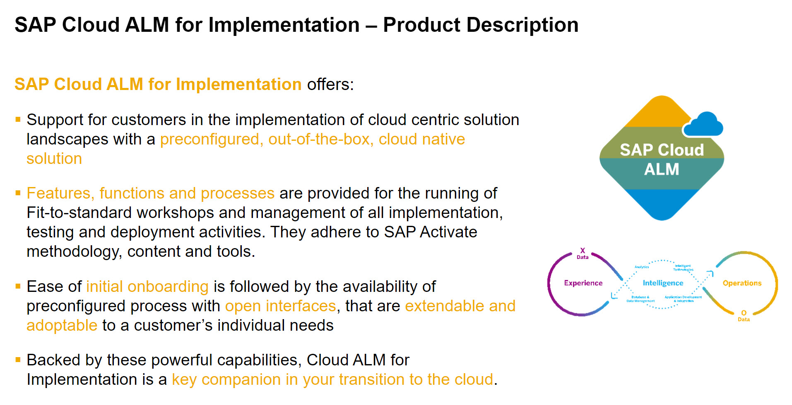

# IIS162 - Manage Your Implementation Using SAP Cloud ALM

## Description

This repository contains the material for the SAP TechEd 2021 session called "IIS162 - Manage Your Implementation Using SAP Cloud ALM".  

## Overview

### Good day!

Let's us spend a moment to understand SAP Cloud ALM

and the core capabilities it offers

In this session you experience how SAP Cloud ALM can help you in adoption of the Intelligent Enterprise and accelerating your implementation projects. 

You will experience end-to-end how the tool supports the implementation journey:

Starting with setting up the project, timelines and onboarding the team in Cloud ALM you will then model your own proces and scope the processes to be implemented as part of the project. Then you will be creating requirements as part of the fit-to-standard workshops and divide the business requirements into user stories describing what needs to be done. As a next step, a manual test case is created and tested before releasing the transports with the help of a feature in SAP Cloud ALM.

During this project journey guided by SAP Cloud ALM you can track and trace the status of the project and its entities in the project dashboard and with the help of the Analytics apps.

Now you can get started. We hope you enjoy the session.

​Cheers, Your SAP Cloud ALM team

## Requirements

You need a modern browser to work with the tool. Additionally, you need sweets/fruit and water to stay nice and hydrated.

## Exercises

- [Getting Started](exercises/ex0/)
    - [System Access and User](exercises/ex0/#System-Access-and-User)
- [Exercise 1 - Project Setup](exercises/ex1/)
    - [Select Project Template and Define Timeboxes/Sprints](exercises/ex1/#Select-Project-Template-and-Define-Timeboxes/Sprints)
    - [Create Teams and Assign Persons](exercises/ex1/#Create-Teams-and-Assign-Persons)
- [Exercise 2 - Document Custom Processes](exercises/ex2/)
    - [Create Custom Solution Process](exercises/ex2/#Create-Custom-Solution-Process)
    - [Model Your Process Diagrams](exercises/ex2/#Model-Your-Process-Diagrams)
    - [Activate Your Custom Solution Processes](exercises/ex2/#Activate-Your-Custom-Solution-Processes)
- [Exercise 3 - Define the Project Process Scope](exercises/ex3/)
    - [Create a Scope](exercises/ex3/#Create-a-Scope)
    - [Pull Solution Processes into scope](exercises/ex3/#Pull-Solution-Processes-into-scope)
    - [Review Project Process Scope](exercises/ex3/#Review-Project-Process-Scope)
- [Exercise 4 - Determine the Project Implementation Scope](exercises/ex4/)
    - [Fit-to-Standard Workshops](exercises/ex4/#Fit-to-Standard-Workshops)
    - [Capture Requirements](exercises/ex4/#Capture-Requirements)
- [Exercise 5 - Manage Requirements Realization](exercises/ex5/)
    - [Break Requirements into User Stories](exercises/ex5/#Break-Requirements-into-User-Stories)
    - [Approve Requirement](exercises/ex5/#Approve-Requirement)
- [Exercise 6 - Manage Tests](exercises/ex6/)
    - [Create Test Case](exercises/ex6/#Create-Test-Case)
    - [Test Execution](exercises/ex6/#Test-Execution)
- [Exercise 7 - Manage Deployments](exercises/ex7/)
    - [Create Feature](exercises/ex7/#Create-Feature)
    - [Assign Transports](exercises/ex7/#Assign-Transports)
    - [Release and Deploy Feature](exercises/ex7/#Release-and-Deploy-Feature)
    - [Review Deployment History](exercises/ex7/#Review-Deployment-History)
- [Exercise 8 - Project Overview and Traceability](exercises/ex8/)
    - [Overview Page](exercises/ex8/#Overview-Page)
    - [Process Traceability](exercises/ex8/#Process-Traceability)
    - [Requirements Traceability](exercises/ex8/#Requirements-Traceability)
- [Exercise 9 - Conclude and Hide Your Project](exercises/ex9/)    

## How to obtain support

Support for the content in this repository is available during the actual time of the online session for which this content has been designed. Otherwise, you may request support via the [Issues](../../issues) tab.

## License
Copyright (c) 2021 SAP SE or an SAP affiliate company. All rights reserved. This project is licensed under the Apache Software License, version 2.0 except as noted otherwise in the [LICENSE](LICENSES/Apache-2.0.txt) file.
