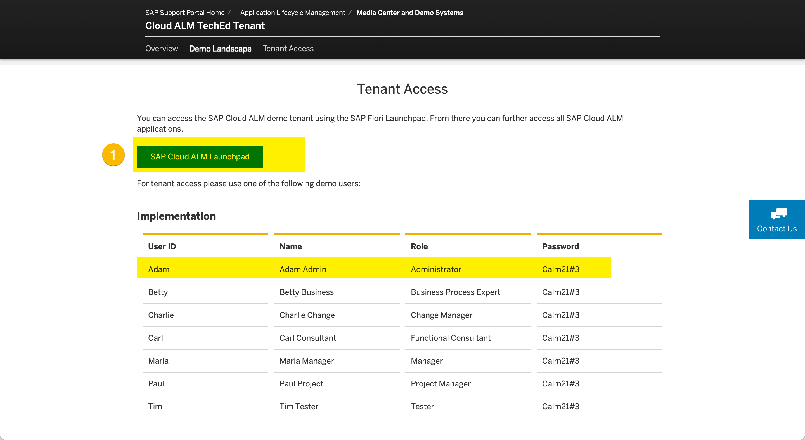
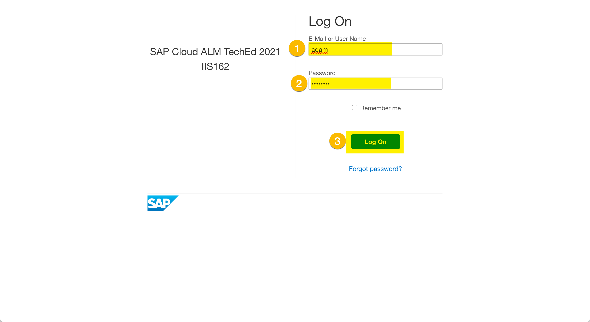

# Getting Started

## Demo Envionment and Naming Conventions

After completing these steps you will have....

## System Access

1. Please open IIS162 Demo System Landing Page [here](https://support.sap.com/en/alm/demo-systems/cloud-alm-teched-iis162.html).

2. Open SAP Cloud ALM tenant
  
  (1) ...

3. Logon to SAP Cloud ALM
  
  (1) ...
  (2) ...
  (3) ...

## Summary

Now that you have ... 

Continue to [Exercise 1 - Project Setup](../ex1/README.md)
