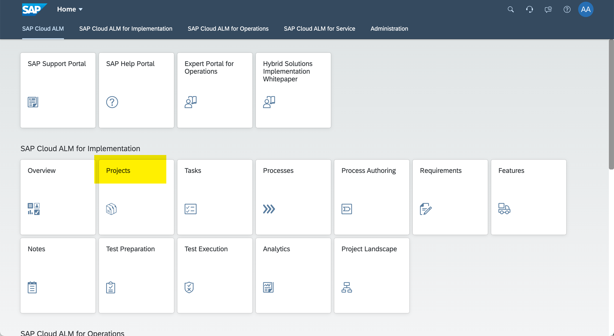
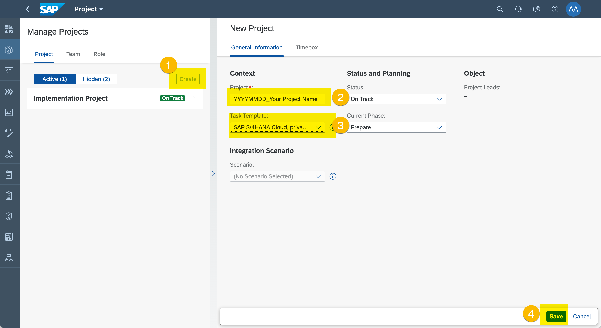
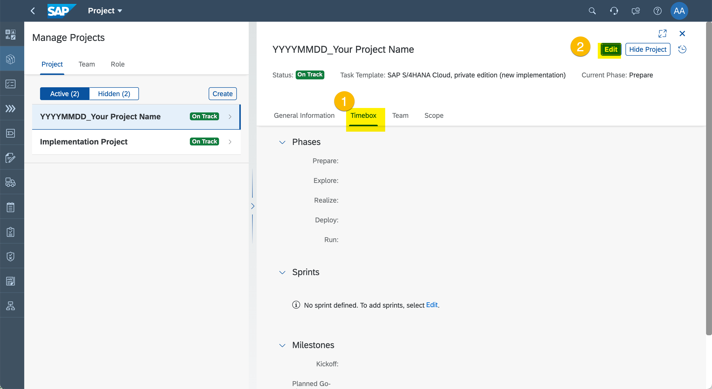
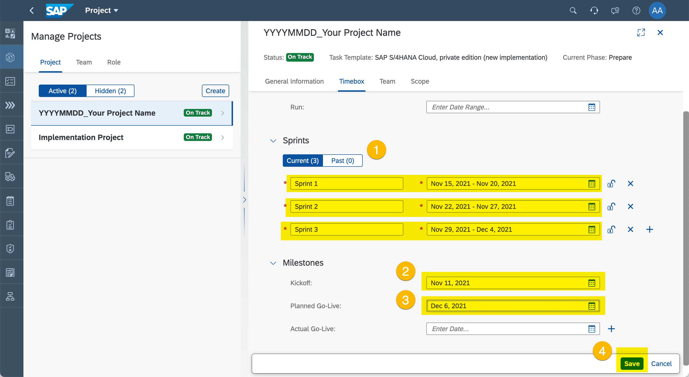
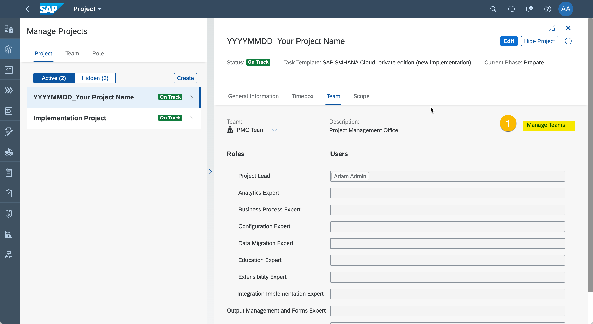
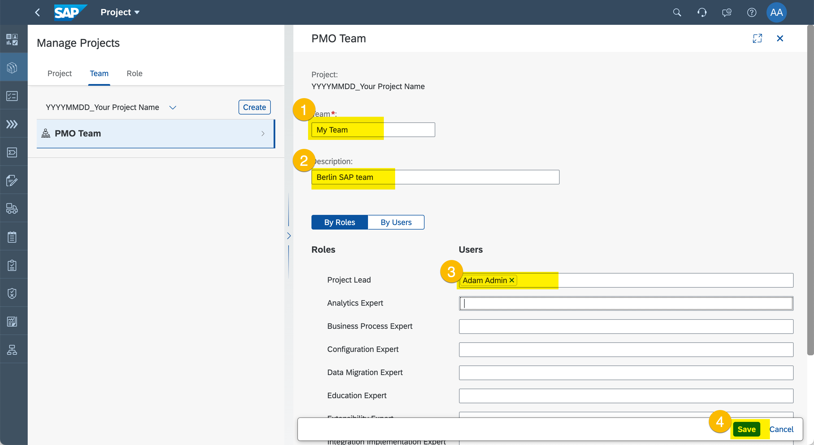

# Exercise 1 - Project Setup

In this exercise, we will create a Project. Projects are the key entities to facilitate SAP implementations. 

Projects can be equiped with project templates to best support different kind of implementaitons e.g. SAP S/4HANA Cloud, SAP SuccessFactors, or Intelligent Enterprise Suite focussed implementations. 
Projects also provide a time boxing and defines the teams and contrete persons doing the project work.

## Select Project Template and Define Timeboxes/Sprints

1. Click Projects.
  

2.	Create Your Project
  
  (1) Click "Create".
  (2) Enter a project name. Please follow naming convention using current date, underscore, and a free text project name \<YYYYMMDD\>_\<Your Project Name\>.
  (3) Select "SAP S/4HANA, private edition (new implementation)" as template.
  (4) Click "Save".

3. Define Timeboxing
  
  (1) ...
  (2) ...
  
  (1) ...
  (2) ...
 
## Create Teams and Assign Persons

> **CAUTION**: Other than in a productive SAP Cloud ALM environment, we are here in a shared demo envionment. Personal information can be seen by others. Please do not enter any personal data e.g. eMail adresses. Thank You!

1. Create Team and Assign Persons
  
  (1) Click "Manage Teams"
  
  (1) ...
  (2) ...
  (3) ...
  (4) Click "Save"

## Summary

You've now setup your project.

Continue to - [Exercise 2 - Document Custom Processes](../ex2/README.md)
