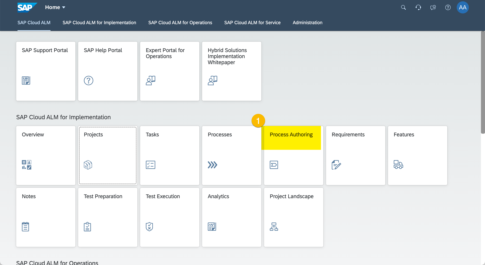
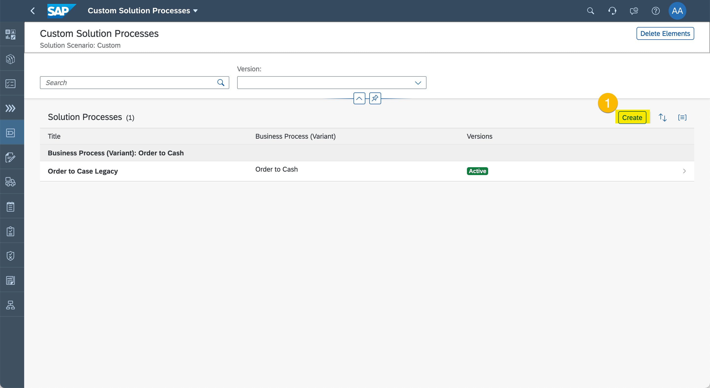
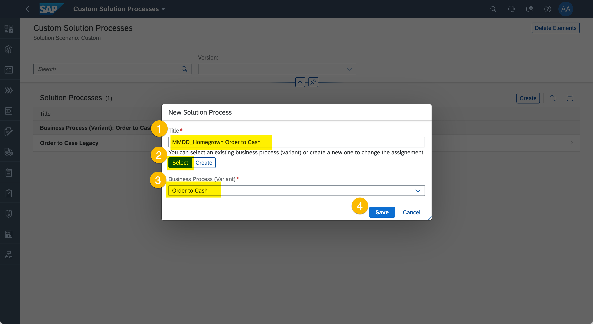
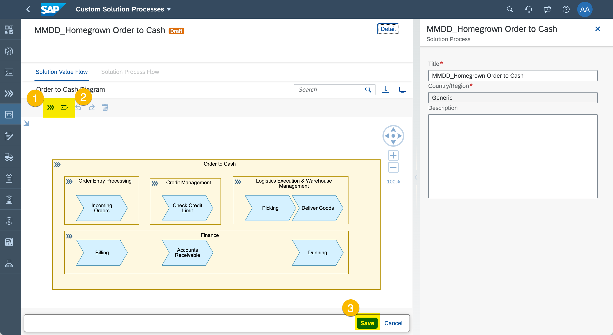
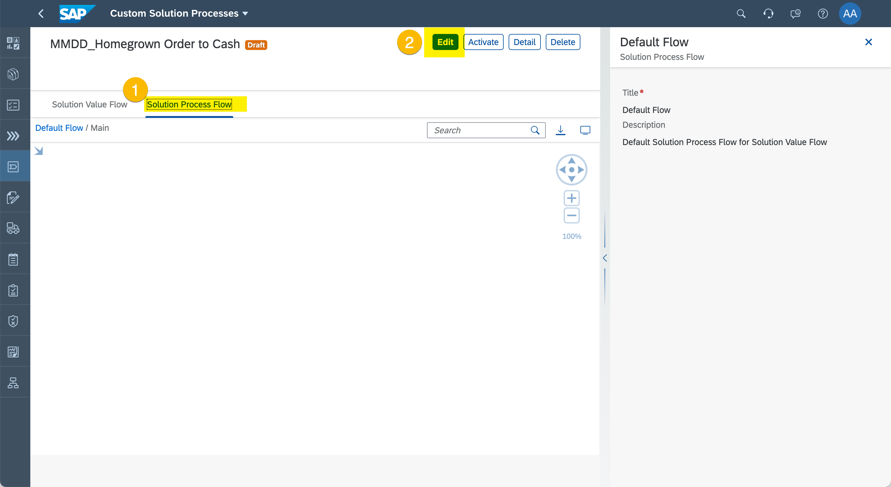
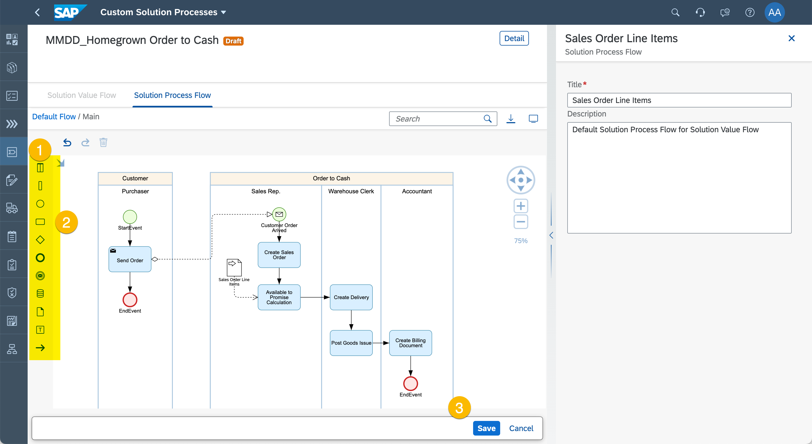
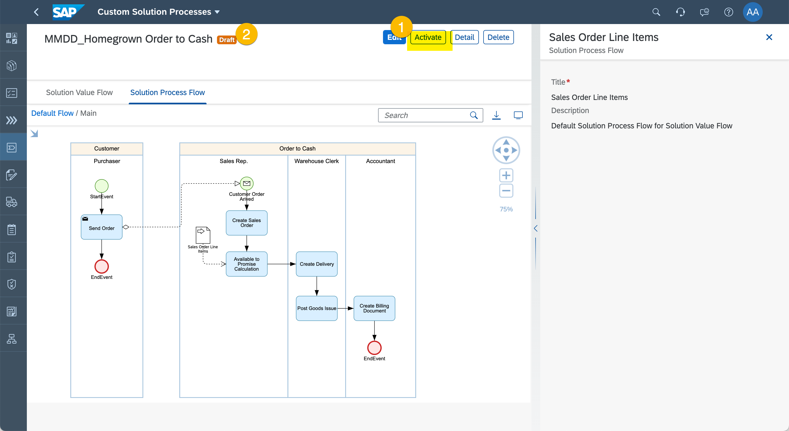

# Exercise 2 - Document Custom Processes

SAP standard practices are comprehensive and support many important functions of a cooperation. Still, companies are very unique and also have own practices that are not (yet) provided as SAP standard content. 

In this chapter you will document your own process models using SAP Cloud ALM.

A “solution process” defines how a busines process is supported by the various solutions. In order to create a new solution process, we need to define which business process (variant) this solution process belongs to. In our example we will create a custom solution process of the “order to cash” process. 
 
 You can now proceed with the exercise by reading the steps below. In case you find issues , you can look at the [recorded demo]
https://wpb101101.hana.ondemand.com/wpb/pub/wa/index.html?library=library.txt&show=project!PR_A34914211023689B

## Create Custom Solution Process

> Please note down the names of the artifacts you create. You might need them later again.

1. Enter "Process Authoring".
  
  (1) Click Process Authoring

2.	Create New Solution Process.
  
  (1) Click "Create".

  
  (1) Enter a Solution Process name. Please follow naming convention using current date, underscore, and a free text Solution Process name \<YYYYMMDD\>_\<Your Solution Process name\>.
  (2) Click "Select".
  (3) Select "Order to Cash" as Business Process (Variant)
  (4) Click "Save".

## Model Your Process Diagrams

> You can model your own diagrams. But always keep reuse in mind. There might be Business Activities / Solution Activities you want to reuse.

1. Model Your **Solution Value Flow** diagram to depict scope of the process.
  
  (1) Use the Business Process toolbar button to add Business Process symbols to the diagram.
  (2) Use the Business Activity popover to reuse and add Business Activities to the diagram.
  (3) Click "Save".

1. Model Your **Solution Process Flow** Diagram to depict the process execution.
  
  (1) Click on "Solution Process Flow" tab.
  (2) Click on "Edit".

  
  (1) Use the palette symbols to model your BPMN diagram. You don't need to model the exact diagram depicted above. 
  (2) Use the Solution Activity popover to reuse and add Solution Activities to the diagram.
  (3) Click "Save".

## Activate Your Custom Solution Processes

1. Activate Your Custom Solution Process
  
  (1) Click "Activate" to make the custom diagram available to implementation projects.
  (2) Check, that the Solution Process Version changed from "DRAFT" to "ACTIVE".

## Summary

You've now modeled your very own custom Solution Process including Solution Value Flow and Solution Process Flow diagrams. You can now go ahead and set it in scope for your implementation project.

Continue to [Exercise 3 - Define the Project Process Scope](../ex3/README.md)
