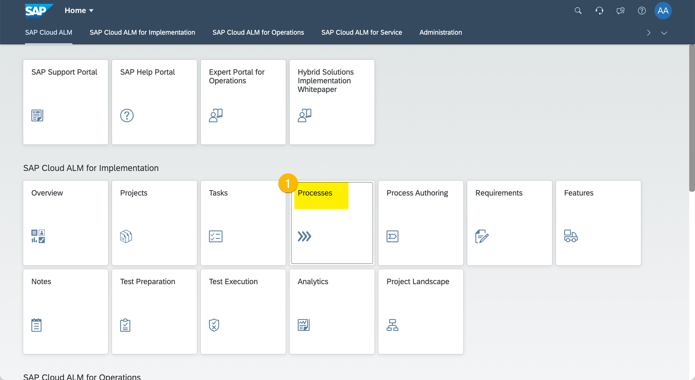
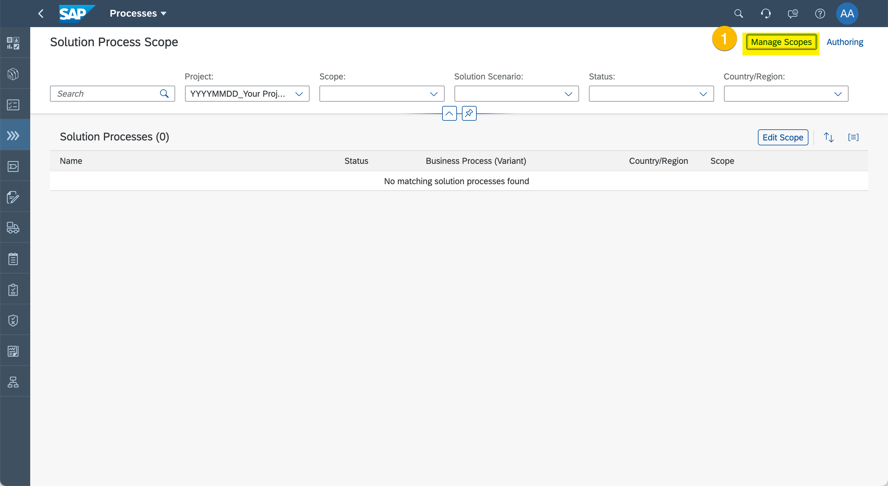
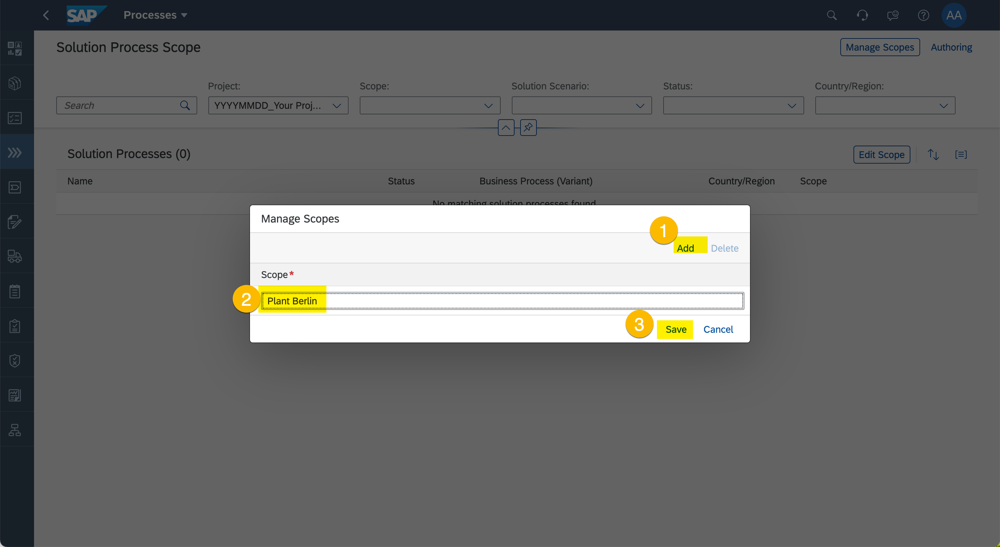
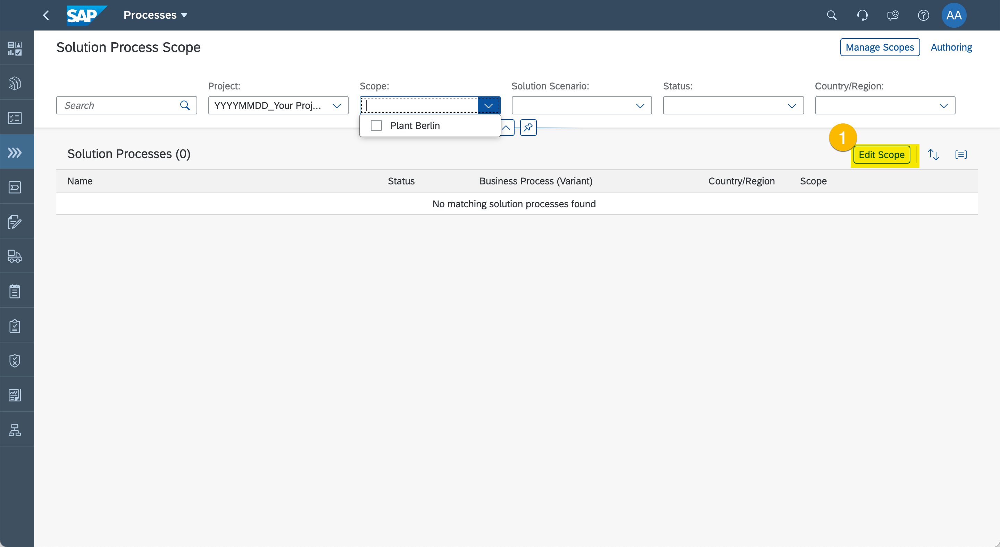
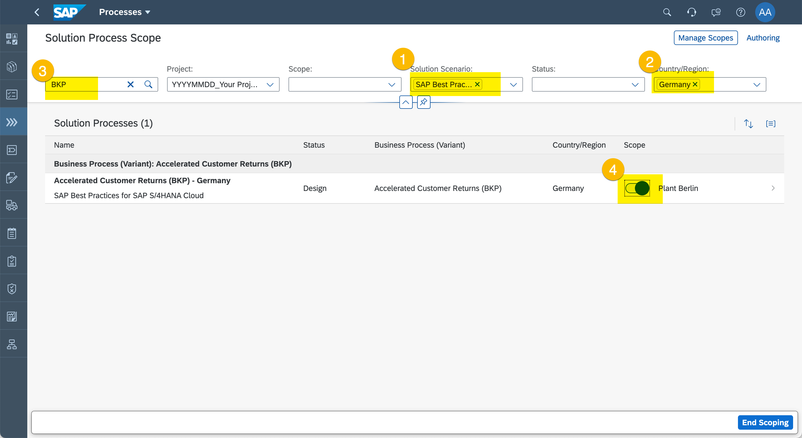
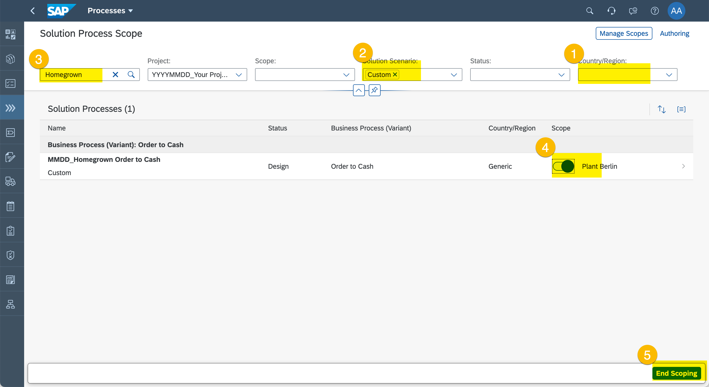
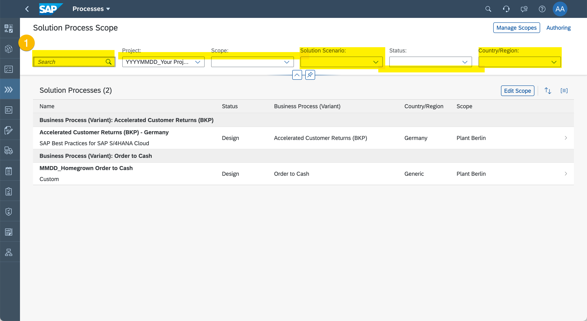

# Exercise 3 - Define the Project Process Scope

A project usually delivers a defined scope under time constraints. The time contraints are defined, you did that when you defined the time boxes of the project. But the defined scope of the project is yet missing. The project scope consists of two elements:
* the Solution Processes that are supposed to be implemented, and
* the requirements, meaning the changes to the standard practices, which need to be implemented or even developed.

In this chapter, you will scope the Solution Processes that are implemented in this project.

## Create a Scope

1. Enter "Processes".
  
  (1) Click "Processes"

2.	Create a New Scope.
  
  (1) Click "Manage Scopes"

  
  (1) Click "Add" to add new Scope to the list.
  (2) Enter a Scope Name e.g. "Plant Berlin".
  (3) Click "Save".

## Pull Solution Processes into scope

1. Enable scoping mode
  
  (1) Click "Edit Scope"

2. Scope SAP Standard Solution Processes
  
  (1) Set Solution Scenario Filter to "SAP Best Practice for SAP S/4HANA Cloud".
  (2) Set Country/Region  Filter to "Germany".
  (3) Search for "BKP".
  (4) Set "Accelerated Customer Returns (BKP) - Germany" in scope.

> You can search for further SAP Standard Processes, please just go ahead a set a few in scope.

1. Scope Custom Solution Processes
  
  (1) Clear Country/region Filter.
  (2) Set Solution Scenario Filter to "Custom".
  (3) Search for the Custom Process you created in the previous Exercise.
  (4) Set your Custom Process in scope.
  (5) Click "End Scoping".

## Review Project Process Scope

1. Review Your Project Process Scope
  
  (1) Clear Search, Solution Scenario, and Country/Region Filter and review the project process scope.

You've now defined the Project Process Scope. You have clarity what Solution Processes the project shall deliver. You can move on and showcase the standard processes. Let's see what needs to be adjusted.

Continue to [Exercise 4 - Determinde the Project Implementation Scope](../ex4/README.md)
