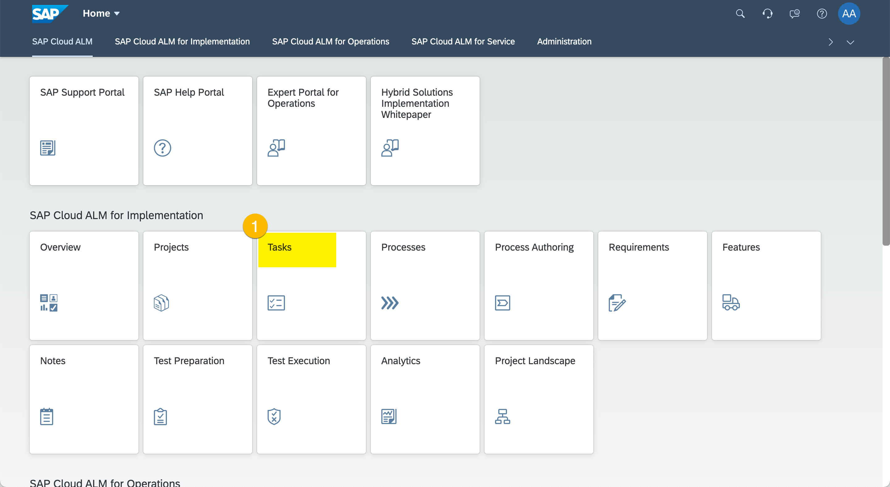
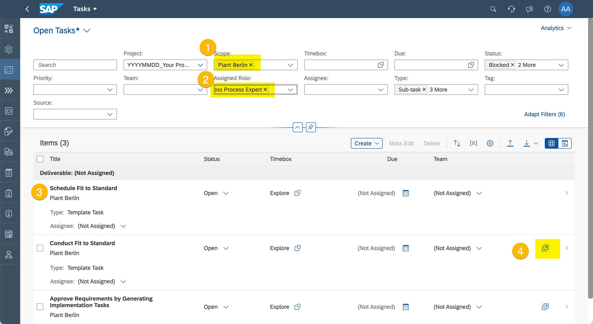
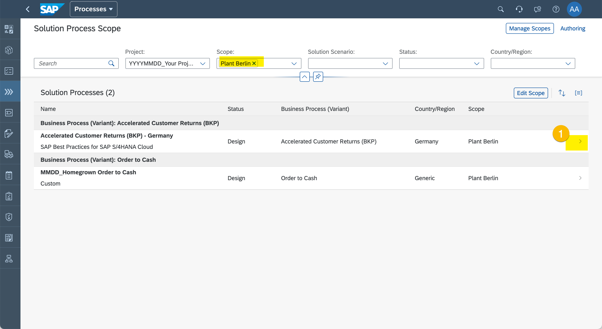
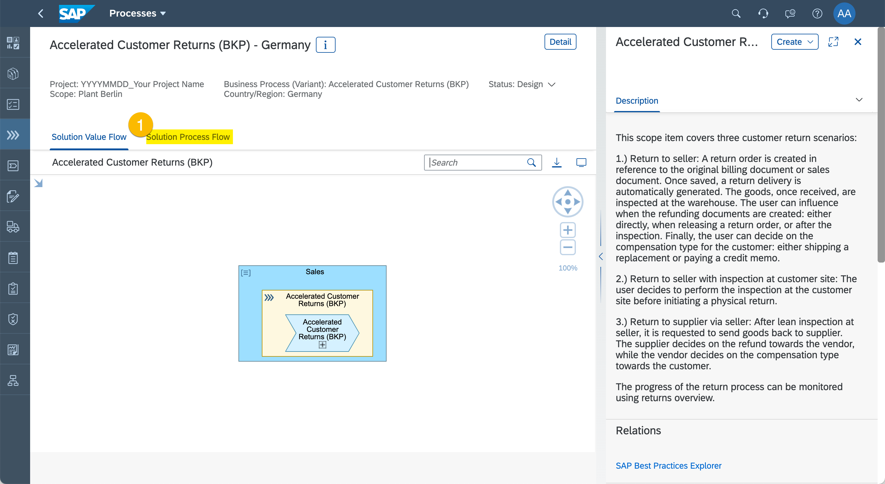
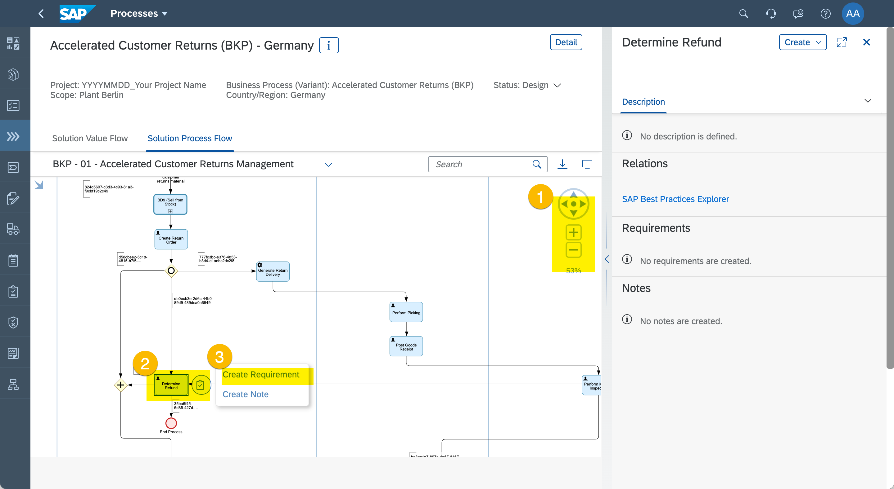
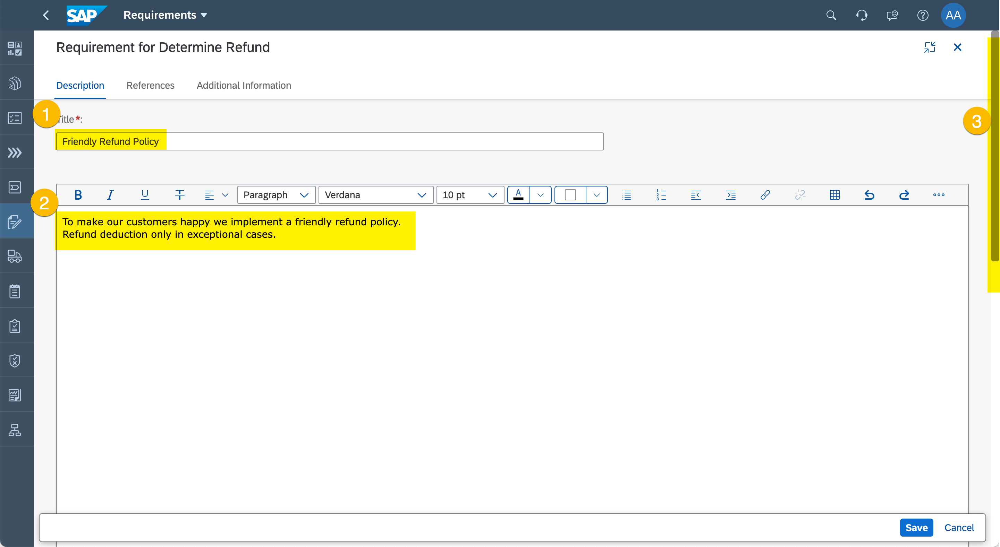
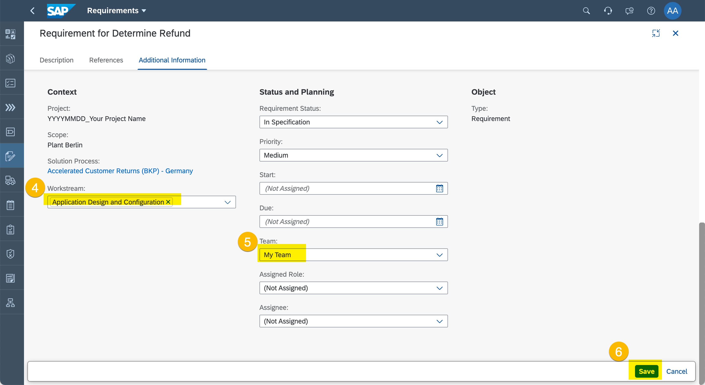

# Exercise 4 - Determinde the Project Implementation Scope

Do you remember the two elements that make the project scope?  It was both the Solution Processes and needed to be implemented or developed. 

Now it's time for the Fit-to-Standard Workshops to find out what Requirements are needed to be taken into consideration.

## Fit-to-Standard Workshops

1. Enter "Tasks".
  
  (1) Click "Tasks".

> Scheduling a workshop is an activity that usually happens  in office or collaboration tools. Let's assume that the workshop was scheduled and the right people invited.

1. Schedule and Kick-off Fit-to-Standard Workshop
  
  (1) Set Scope Filter to the scope name (e.g. "Plant Berlin") you defined in the previous Excercise.
  (2) Set Assigned Role Filter to "Business Process Expert".
  (3) Check there are a few tasks generated for your scope e.g. "Schedule Fit to Standard", "Consuct Fit to Standard", or "Approve Requirements by Generating Implementation Tasks".
  (4) Click navigation intent icon for "Conduct Fit to Standard" to get to the app linked to the Task.

## Capture Requirements

1.	Select Solution Process
  
  (1) Click on details icon for "Accelerated Customer Returns (BKP) - Germany".

2. Display Solution Process Flow diagram
  
  (1) Click "Solution Process Flow" tab.

3. Create Requirement
  
  (1) Use the Navigator control to zoom and move in diagram.
  (2) Find and select "Determine Refund" Solution Activity.
  (3) Use call out button and click "Create Requirement".

4. Specify Requirement
  
  (1) Enter "Friendly Refund Policy" as title.
  (2) Enter "To make our customers happy we implement a friendly refund policy, Refund deductions only in exceptional cases." as description.
  (3) Use scollbar to get to the lower areas of the screen (if needed).
 
  
  (4) Set Workstream to "Application Design and Configuration".
  (5) Set Team to the team you defined during project setup e.g. "My Team".
  (6) Click "Save".

5. Set Solution Process Status
  
  (1) Check your Requirement is visible in the Requirements-section.
  (2) Set Status to "Realization".

## Summary

You've now defined the complete Project Scope. You know the Solution Processes and the Requirements. Next we break down the work into User Stories.

Continue to [Exercise 5 - Manage Requirements Realization](../ex5/README.md)
