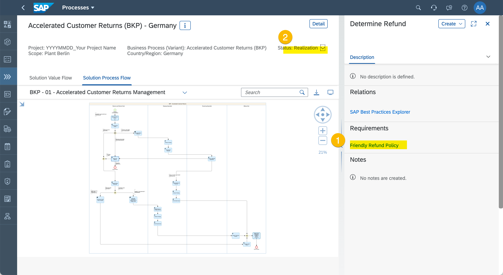

# Exercise 4 - Determinde the Project Implementation Scope

Do you remember the two elements that make the project scope?  It was both the Solution Processes and needed to be implemented or developed. 

Now it's time for the Fit-to-Standard Workshops to find out what Requirements are needed to be taken into consideration.

## Fit-to-Standard Workshops

1. Enter "Tasks".
  
  (1) Click "Tasks".

> Scheduling a workshop is an activity that usually happens  in office or collaboration tools. Let's assume that the workshop was scheduled and the right people invited.

1. Schedule and Kick-off Fit-to-Standard Workshop
  
  (1) ...
  (2) ...
  (3) ...
  (4) ...

## Capture Requirements

1.	Select Solution Process
  
  (1) ...

2. Display Solution Process Flow diagram
  
  (1) ...

3. Create Requirement
  
  (1) ...
  (2) ...
  (3) ...

4. Specify Requirement
  
  (1) ...
  (2) ...
  (3) ...
  
  (4) ...
  (5) ...
  (6) ...

5. Set Solution Process Status
  
  (1) ...
  (2) ...

## Summary

You've now defined the complete Project Scope. You know the Solution Processes and the Requirements. Next we break down the work into User Stories.

Continue to [Exercise 5 - Manage Requirements Realization](../ex5/README.md)
