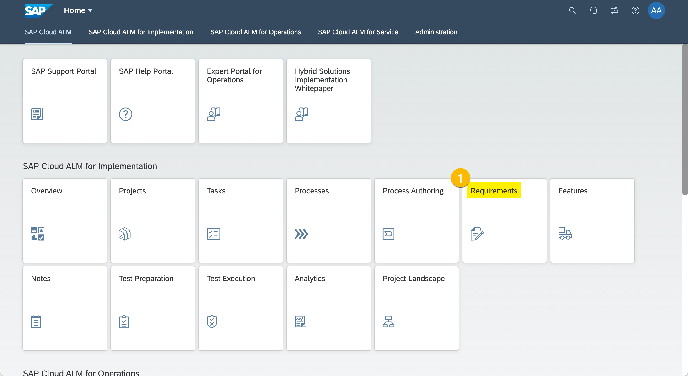
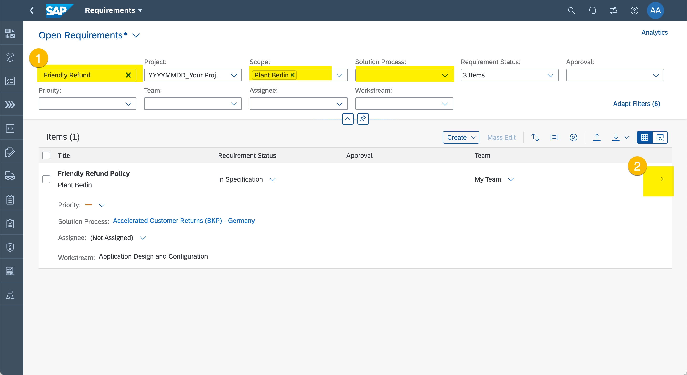
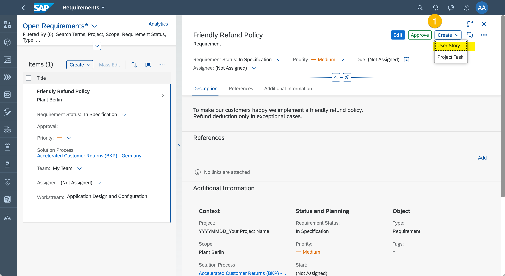
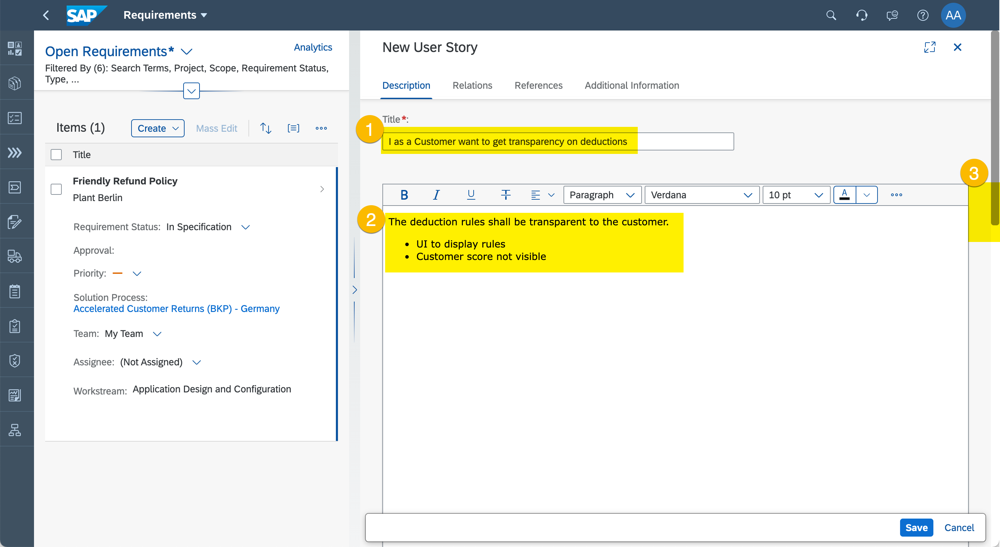
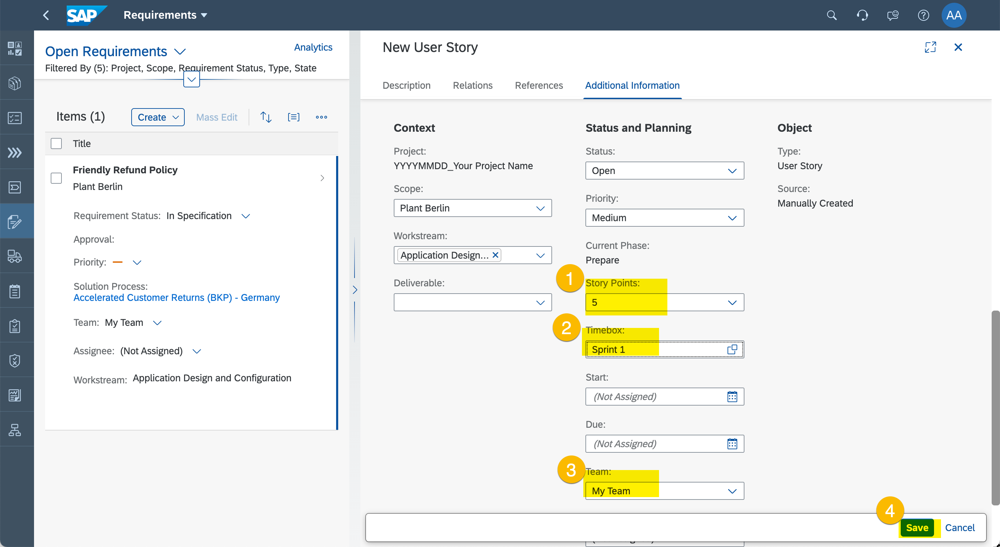
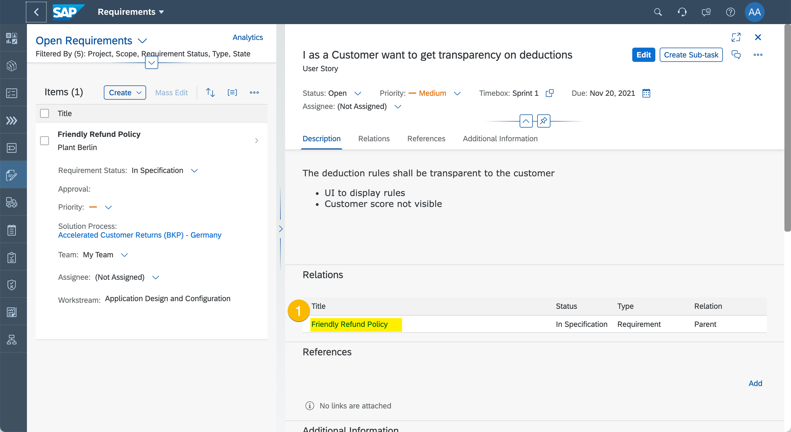
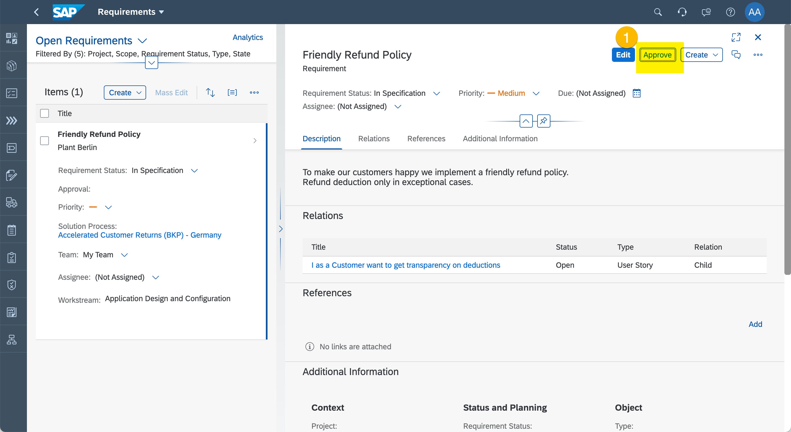
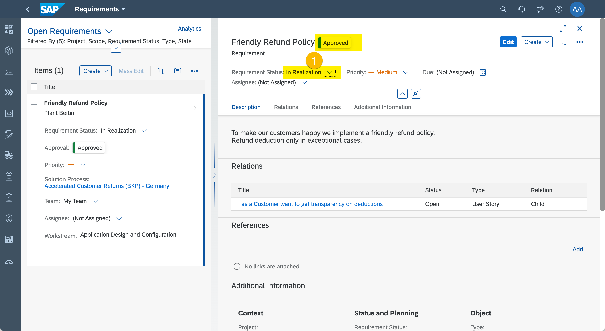

# Exercise 5 - Manage Requirements Realization

In this exercise, we will define User Stories. The team is executing the project using Sprints. User Stories help to split the work into smaller chunks and to distribute the work across sprints and optionally across teams/users. 
 
 You can now proceed with the exercise by reading the steps below. In case you find issues , you can look at the [recorded demo](https://wpb101101.hana.ondemand.com/wpb/pub/wa/index.html?library=library.txt&show=project!PR_DF676B1D610B89C)

## Break Requirements into User Stories

1. Enter "Requirements"
  
  (1) Click "Requirements"

2.	Display Requirement
  
  (1) Search "Friendly Refund".
  (2) Use the details icon to display the the Requirements details.

3. Create User Story
  
  (1) Click "Create - User Story".

4. Specify User Story
  
  (1) Enter "I as Customer want to get transparency on deductions" as title.
  (2) Enter a Requirement description.
  (3) Use scroll bar to get to lower areas of the screen (if needed).

  
  (1) Set Story Points to "5".
  (2) Set Timebox to "Sprint 1".
  (3) Set Team to "My Team".
  (4) Click "Save".

5. Navigate back to Requirement
  
  (1) Click on Requirement name "Friendly Refund Policy" in the Relations section.

> You can breakdown the Requirement into many User Stories. You may want to create further User Stories. They will all show up in the "Relations" section of the Requirement.
> Even User Stories can have Sub-Tasks. You should give it a try. If you have time, just define some.

## Approve Requirements

1. Approve the Requirement
  
  (1) Click "Approve".

2. Start realizing the Requirement
  
  (1) Change Requirements Status to "In Realization".

## Summary

You've now managed to break down the work. The teams are ready to work  - well done. But there are also some duties we should not forget. When you build something, you should test it.

Continue to [Exercise 6 - Manage Test Cases](../ex6/README.md)
