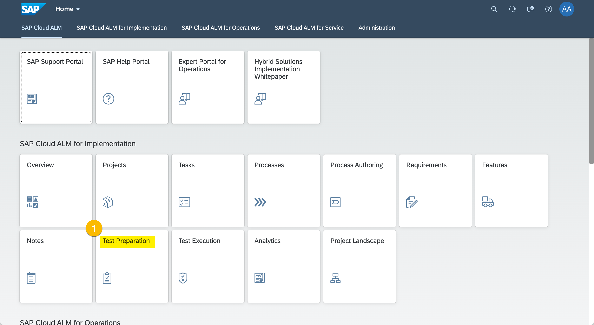
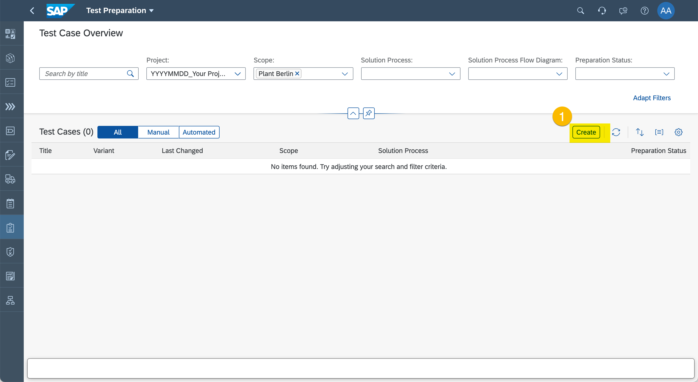
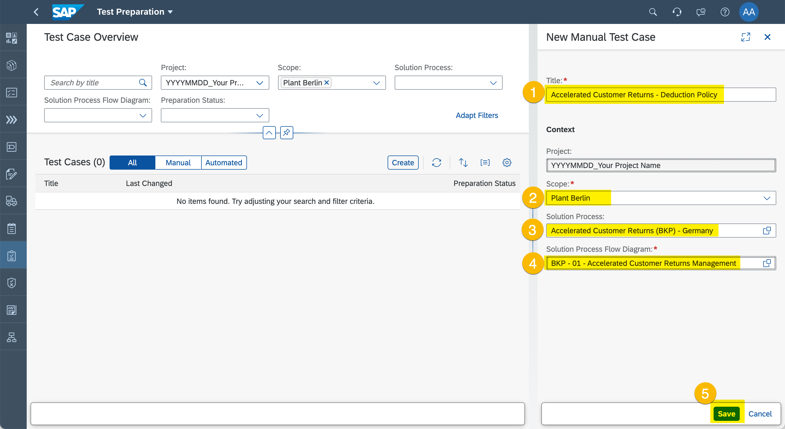
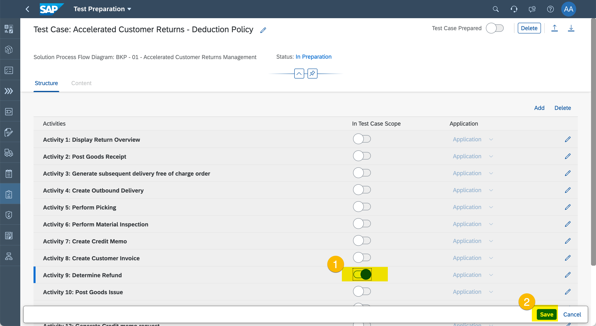
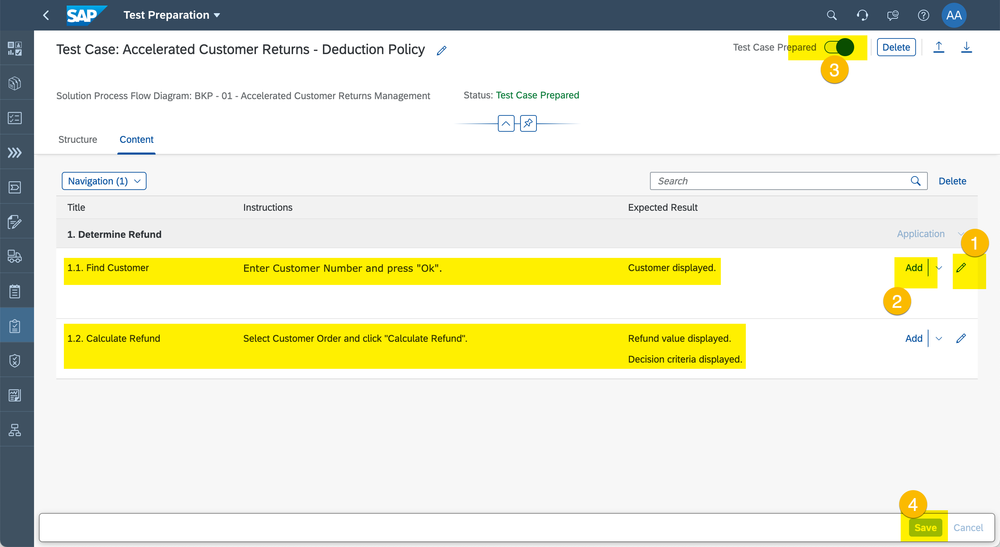
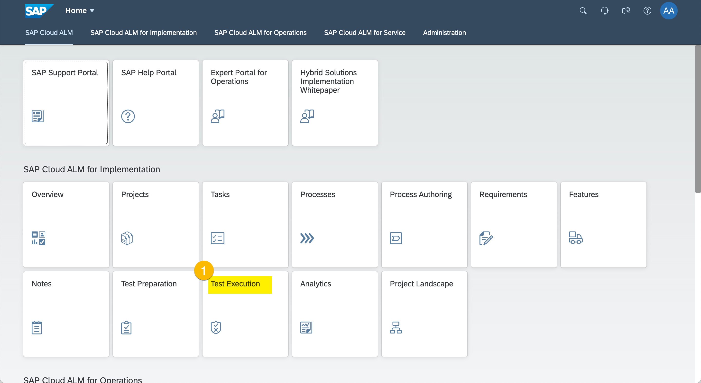
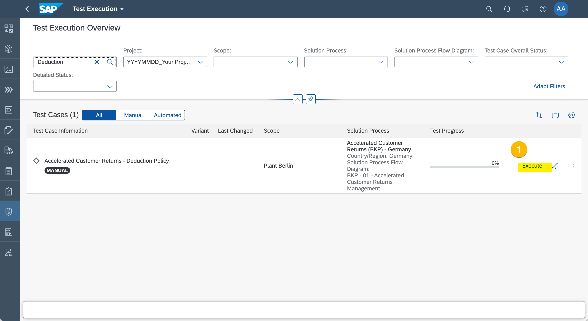
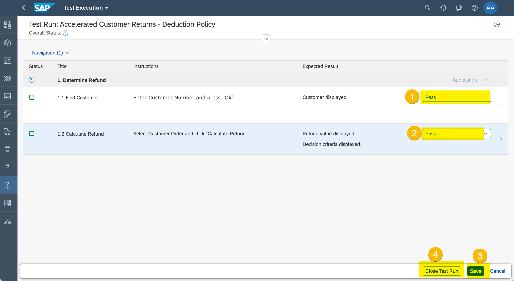
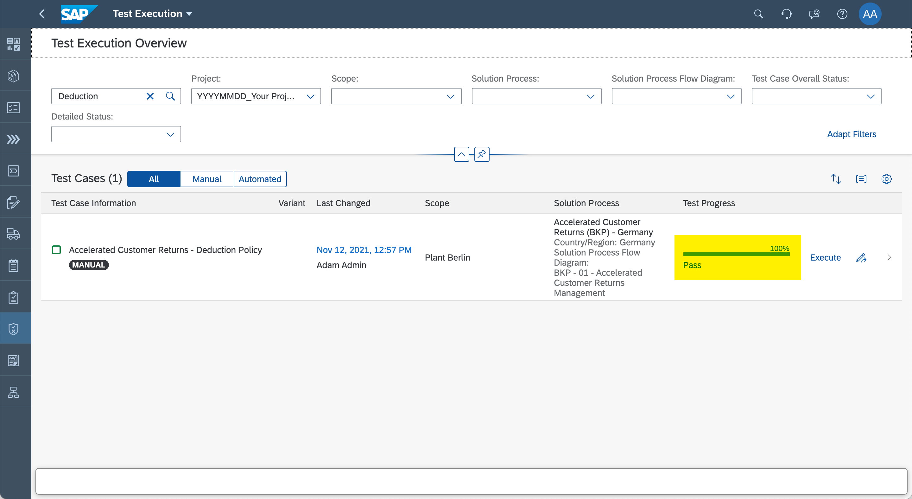

# Exercise 6 - Manage Tests

Testing is often underestimated. Eventually testing keeps you out of jail. Let's see how SAP Cloud ALM can help to make this tasks little more pleasant. 

## Create Test Case

1. Enter "Test Preparation".
  
  (1) Click "Test Preparation"

2. Create Test Case.
  
  (1) Click "Create".

3. Specify Test Case.
  
  (1) Enter "Accelerated Customer Returns - Deduction Policy" as title.
  (2) Set Scope to "Plant Berlin".
  (3) Set Solution Process to "Accelerated Customer Returns (BKP) - Germany".
  (4) Set Solution Process Flow Diagram to "BKP - 01 - Accelerated Customer Returns Management". 
  (5) Click "Save".

1. Select Relevant Solution Activities.
  
  (1) Add "Determine Refund" to Test Case Scope.
  (2) Click "Save".

5. Provide Soltution Action Instructions and Mark Test Case as "Prepared".
  
  (1) Click edit button to change Test Case Solution Action "1.1 Find Customer" as depicted in the screenshot. 
  (2) Use "Add" button to add second Test Case Solution Action "1.2 Calculate Refund" as depicted in the screenshot.
  (3) Set Test Case Status to "Test Case Prepared".
  (4) Click "Save".

## Test Execution

1. Navigate to "Test Execution".
  
  (1) Click "Test Execution".

2. Start Test Execution
  
  (1) Find your Test Case and click "Execute" to start Test Run.

3. Perform Test and Capture Test Results
  
  (1) Set Solution Action "1.1 Find Customer" to "Pass".
  (2) Set Solution Action "1.2 Calculate Refund" to "Pass".
  (3) Click "Save".
  (4) Click "Close Test Run".

4. Review Test Result
  
  Review Test Status.

## Summary

You've now know that the configurations and developments do what they are supposed to do. This is good. Let's see how the deployment of configuration and developments can be orchestrated.

Continue to [Exercise 7 - Manage Deployments](../ex7/README.md)
