# Exercise 7 - Manage Deployments

In this exercise, we will manage the deployment of Transport Requests through the landscape. SAP Cloud ALM bundles Transport Requests into Features. Let's do this.
 
 You can now proceed with the exercise by reading the steps below. In case you find issues , you can look at the [recorded demo](https://wpb101101.hana.ondemand.com/wpb/pub/wa/index.html?library=library.txt&show=project!PR_9DDFE782732B9897).

## Create Feature

1. Enter Features
  
  (1) Click "Features".

2. Create Feature
  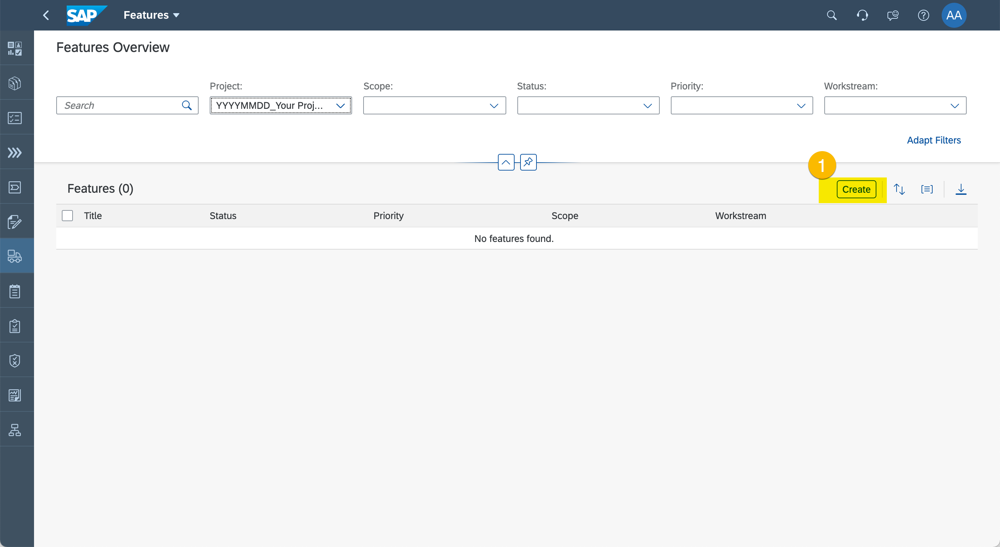
  (1) Click "Create".

3. Specify Feature 
  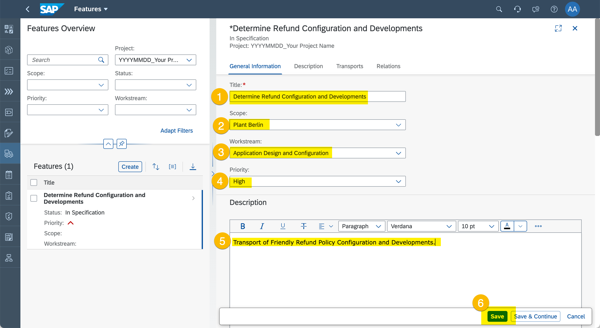
  (1) Enter "Determine Refund Configuration and Developments" as title.
  (2) Set Scope "Plant Berlin".
  (3) Set Workstream to "Application Design and Configuration".
  (4) Set Priority to "High".
  (5) Enter "Transport of Friendly Policy Configuration and Developments." as description.
  (6) Click "Save".  

## Assign Transports

1. Start Implementation
  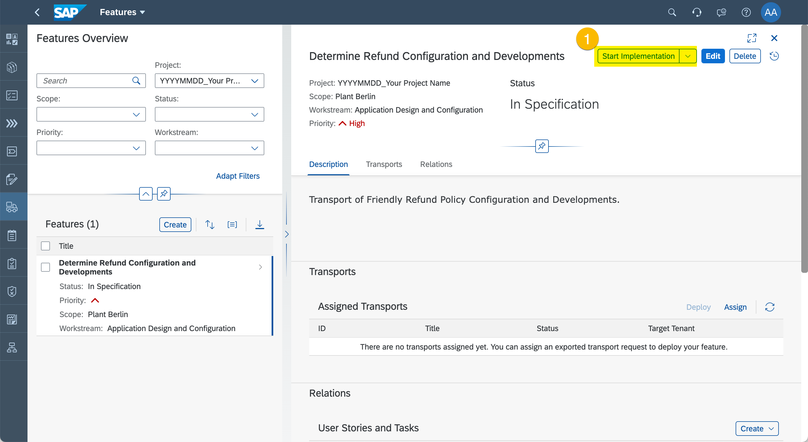
  (1) Click "Start Implementation".

> Please assign only one Transport Request to your Feature. This a courtesy to your fellow workshop participants to make sure everybody finds at least one Transport Request to assign.
2. Assign Transport Request
  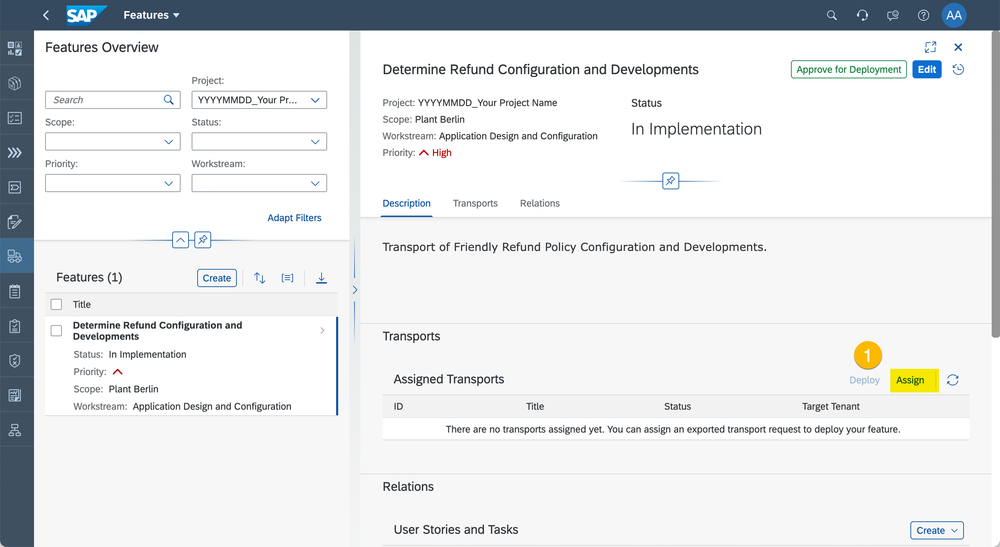
  (1) Click "Assign".

3. Find Transport Request
  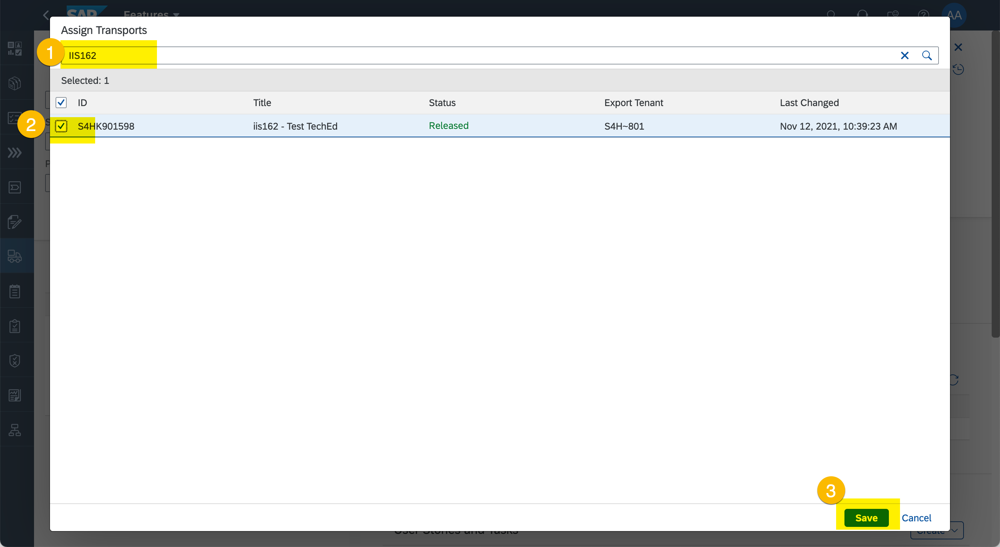
  (1) Search for Transport Requests containing string "IIS162".
  (2) Select **one** Transport Request.
  (3) Click "Save".

  A transport can only be assigned to one Feature. When you select a Transport Request it may already be assigned to a transport by a fellow workshop participant. In this case you would see the following error message:

  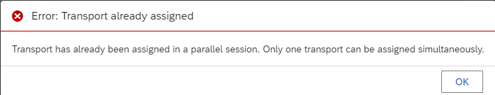
  In this case please re-open the dialog and pick a different Transport Request.

## Release and Deploy Feature

1. Delpoy to Quality Assurance
  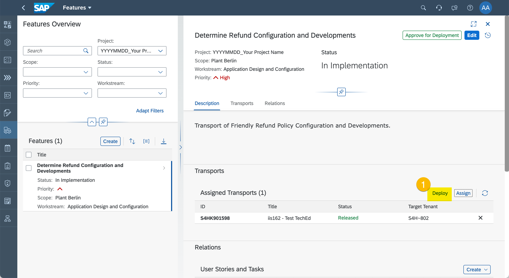
  (1) Click "Deploy" to release Transport Request from **development** tenant/client to **test** tenant/client.

2. Refresh Transport Request Status
  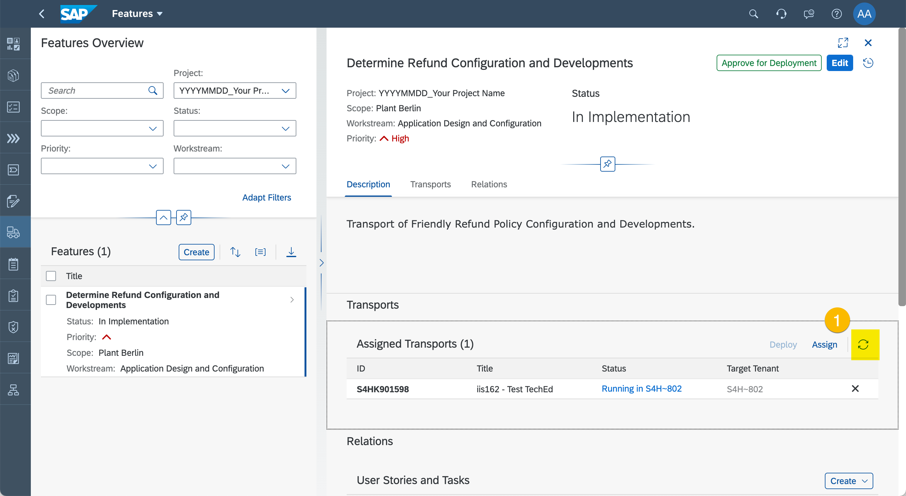
  (1) Click refresh icon and wait until the Transport Request arrived in the target tenant/client.

3. Approve for Production
  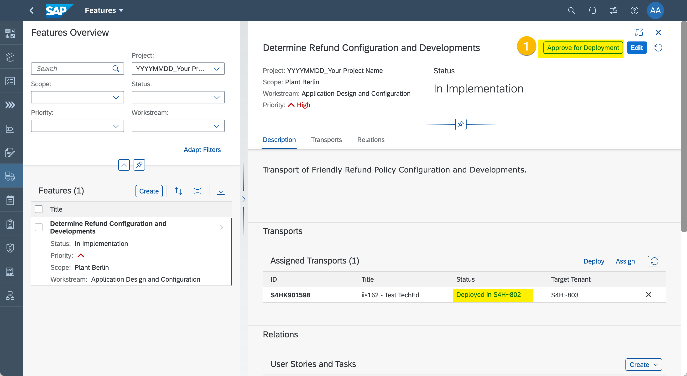
  (1) Click "Approve for Deployments" after the Transport Request has beed successfully tested in the test tenant/client.

4. Deploy to Production
  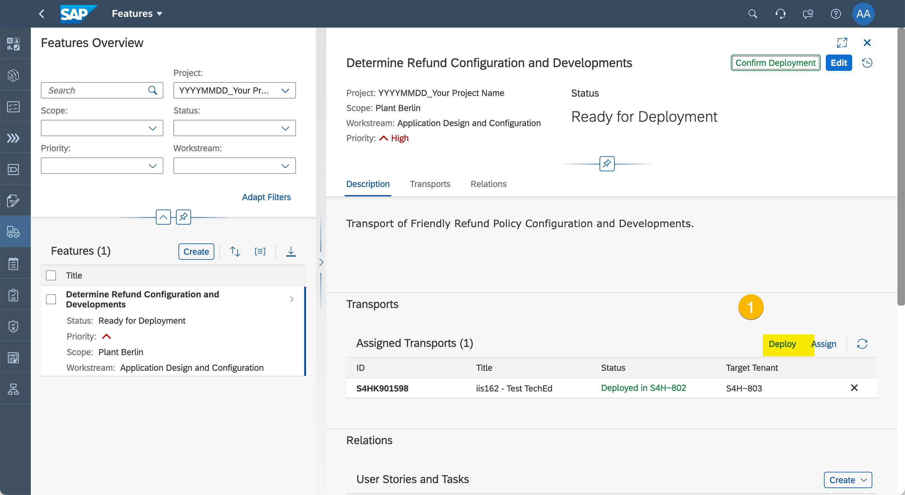
  (1) Click "Deploy" to release Transport Request from **test** tenant/client to **production** tenant/client.

5. Refresh Transport Request Status
  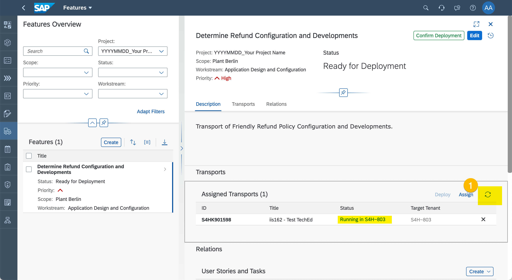
  (1) Click refresh icon and wait until the Transport Request arrived in the target tenant/client.

6. Confirm Deployment
  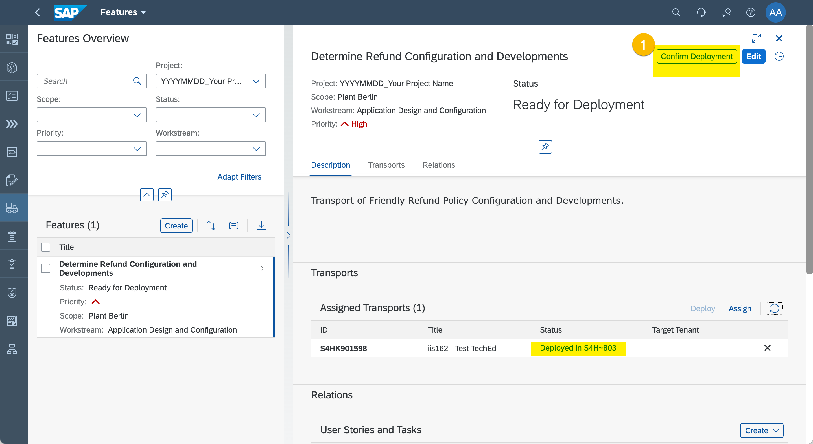
  (1) Click "Confirm Deployment" to confirm that the Transport Request reached the production tenant/client.

7. Open History
  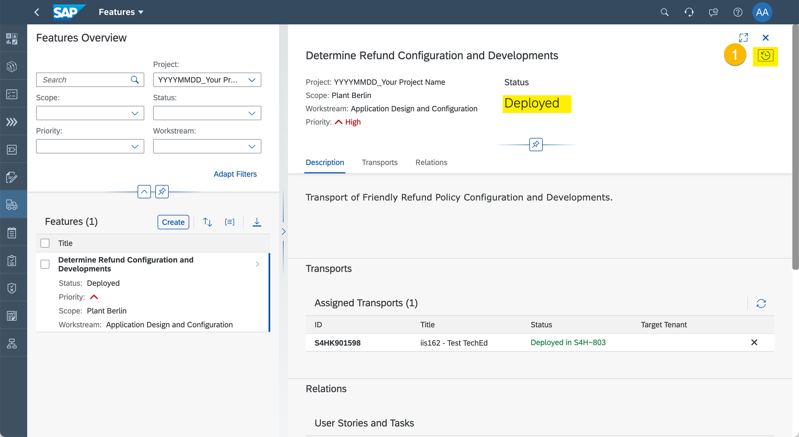
  (1) Click history icon.

## Review Deployment History

1. Review History
  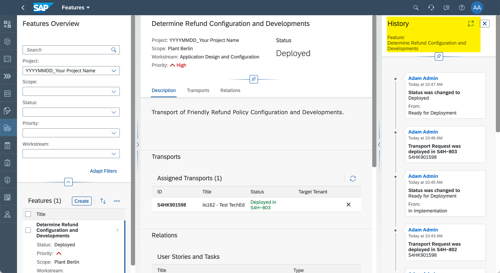
> Review Feature history to find out who deployed what, when, and to what target tenant/client.
 
## Summary

You've now deployed configurations and developments. Well, the hard work is done. Or have we missed something? Let's check...

Continue to [Exercise 8 - Project Overview and Traceability](../ex8/README.md)
