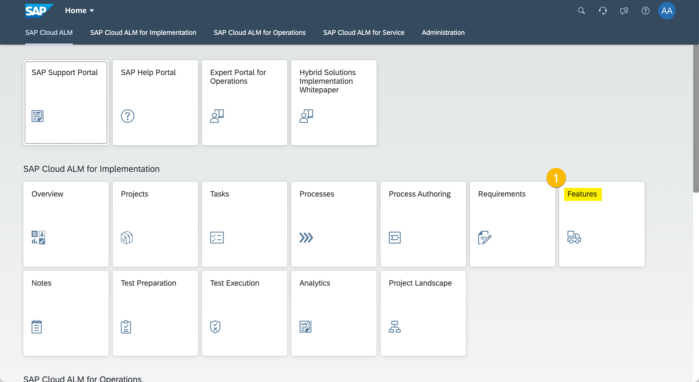

# Exercise 7 - Manage Deployments

In this exercise, we will create...

## Create Feature
  
  (1) ...

  
  (1) ...

  
  (1) ...
  (2) ...
  (3) ...
  (4) ...
  (5) ...
  (6) ...

## Assign Transports

  
  (1) ...

  
  (1) ...

  
  (1) ...
  (2) ...
  (3) ...

## Release and Deploy Feature

  
  (1) ...

  
  (1) ...

  
  (1) ...

  
  (1) ...

  
  (1) ...

  
  (1) ...

  
  (1) ...

## Review Deployment History

  
> ...
 
## Summary

You've now ...

Continue to [Exercise 8 - Project Overview and Traceability](../ex8/README.md)
