# Exercise 8 - Project Overview and Traceability

Keeping track on Project Progress and making sure everything is consistent is a task for SAP Cloud ALM Overview Page and Analytics. Let's get it a glimpse.
 
 You can now proceed with the exercise by reading the steps below. In case you find issues , you can look at the [recorded demo](https://wpb101101.hana.ondemand.com/wpb/pub/wa/index.html?library=library.txt&show=project!PR_E4DD6C1115788FA4)

## Overview Page

1. Enter Overview Page.
  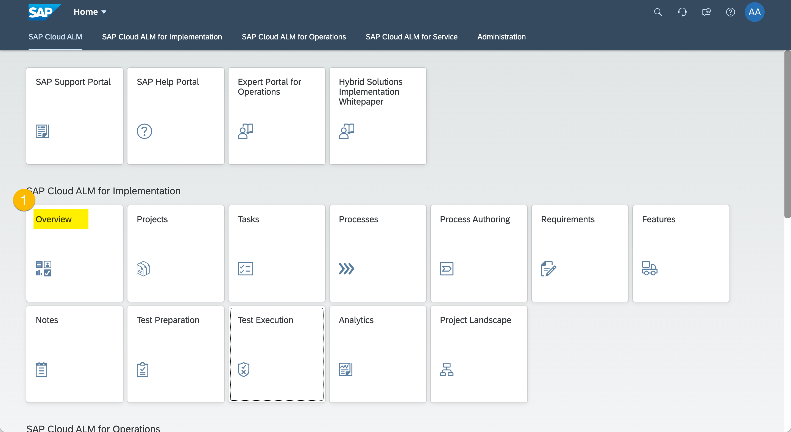
  (1) Click "Overview".

1. Adapt Filters.
  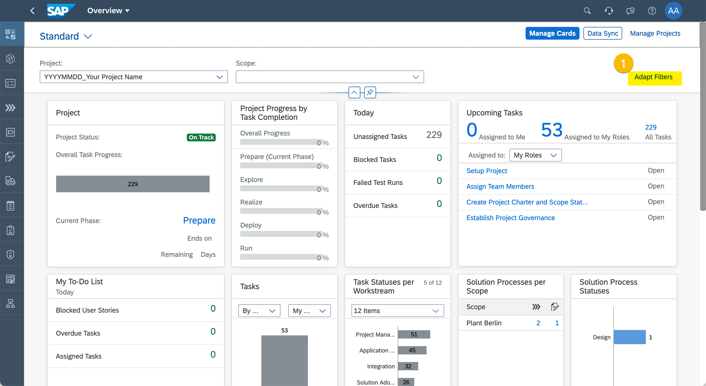
  (1) Click "Adapt Filters".

  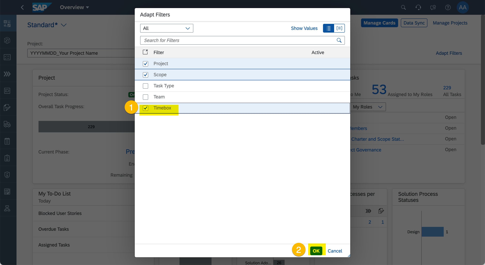
  (1) Select "Timebox".
  (2) Click "Ok".

  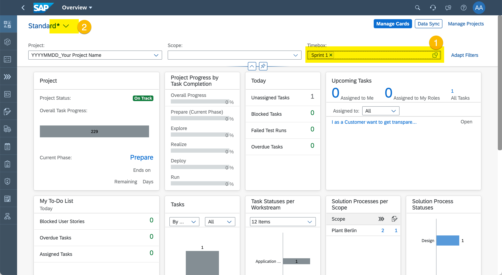
  (1) Set Timebox Filter to "Sprint 1".
  (2) Click view variant drop down.

  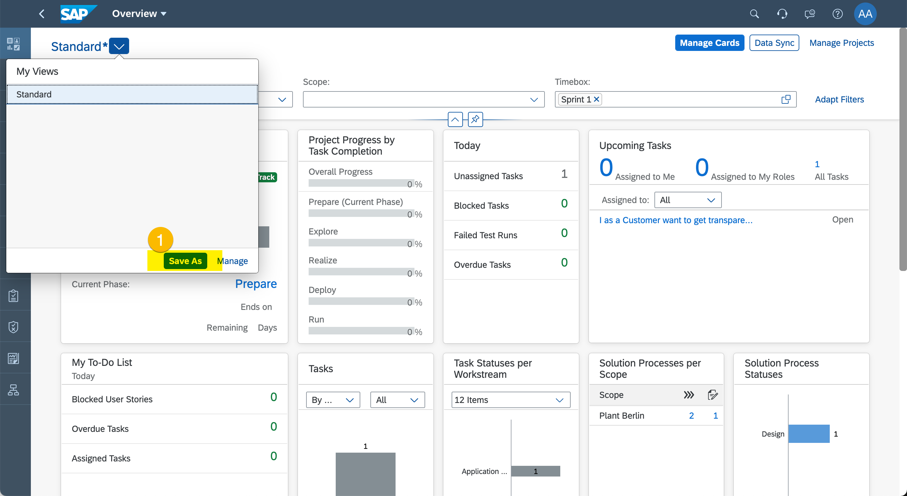
  (1) Click "Save As".

  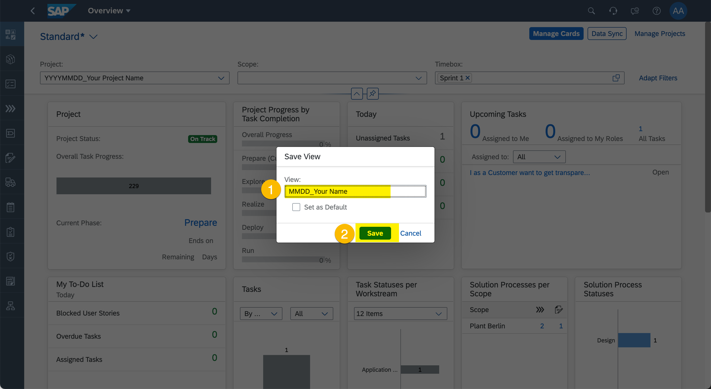
  (1) Enter name for the view following current month, underscore and a free text title. PLease follow form \<MMDD\>_\<Free Text Title\>.
  (2) Click "Save".

> Please note your user story will appear in this filtered view only if you assigned it to "Sprint 1" in previous exercise. In case your user story is not showing up, please review your user story Timebox assignment.

1. Navigate to User Story
  
  (1) Click on user story "I as a Customer wanto to get transparency on deductions".

  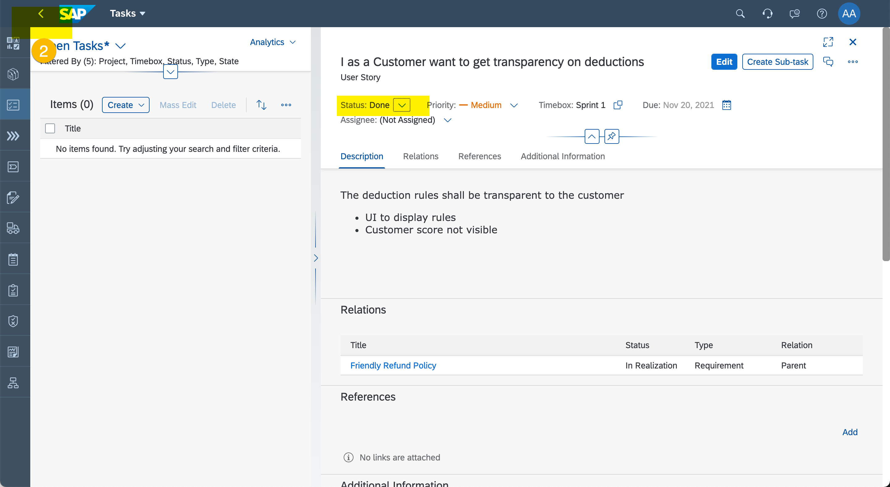
  (1) Set User Story Status to "Done".
  (2) Navigate back to Overview Page.

  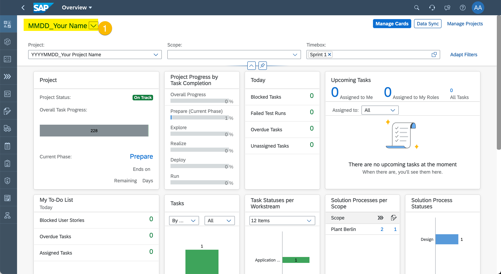
  (1) Select your view.
  

## Process Traceability

1. Enter "Analytics".
  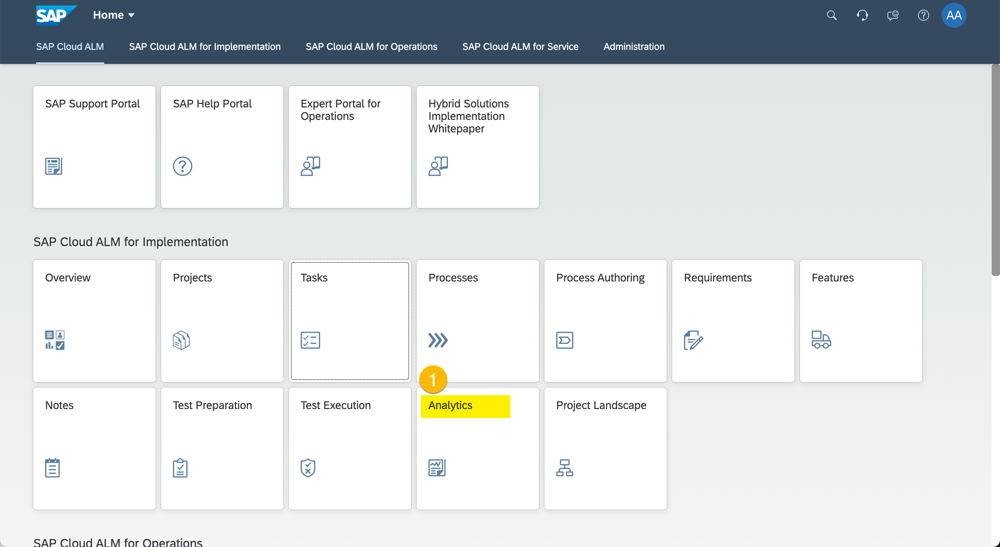
  (1) Click "Analytics".

2. Start Process Traceability
  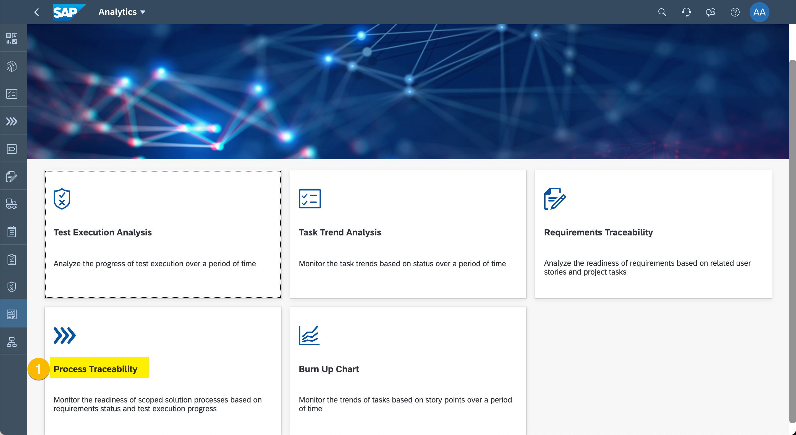
  (1) Click "Process Traceability".

3. Check Process Status agains Requirement, Test Preparation, and Test Execution
  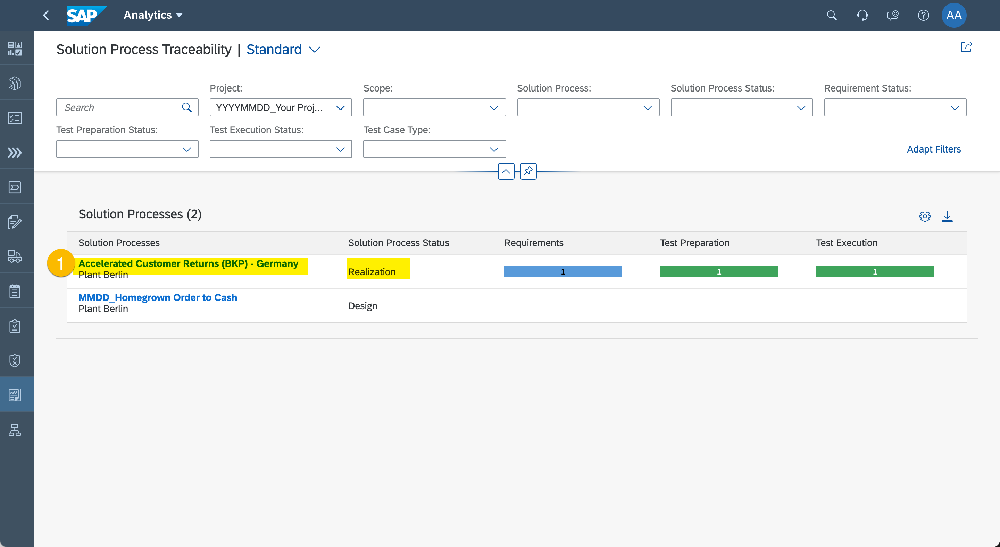
  (1) Review the Solution Process Status for consistency issues and click on "Accelerated Customer Return (BKP) - Germany" to resolve the issues.

4. Change Process Status
  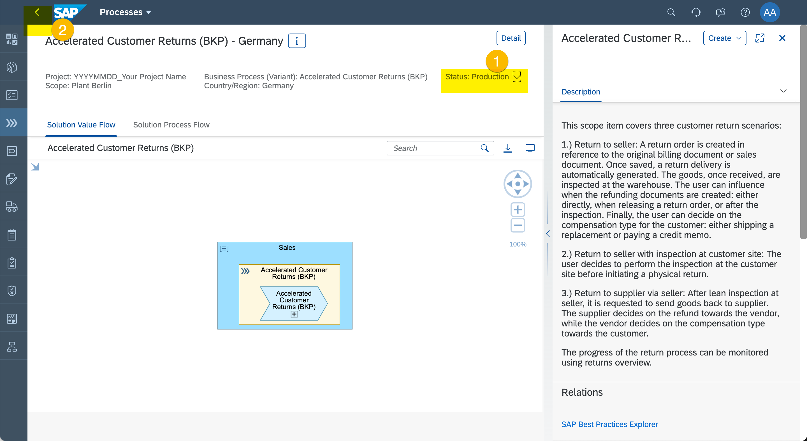
  (1) Set Process Status to "Production".
  (2) Navigate back to Process Traceability.

5. Review Process Traceability
  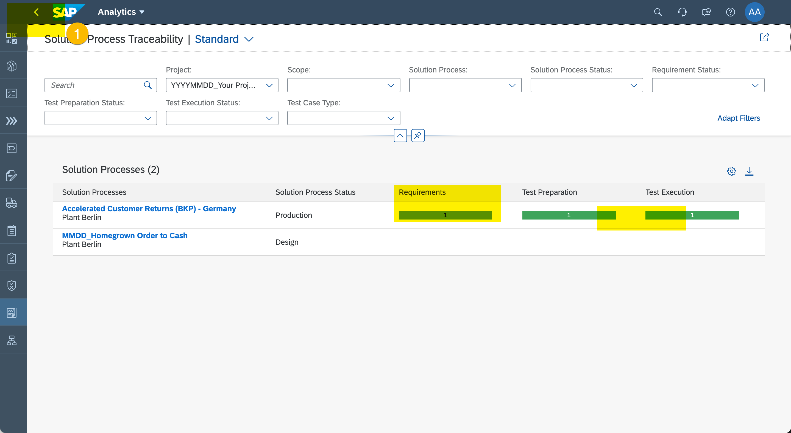
  (1) Review the Solution Process Status for consistency issues. All resolved :-)

## Requirements Traceability
> Use the Browser back button to go back to list of Analytical Reports

1. Start Requirements Traceability
  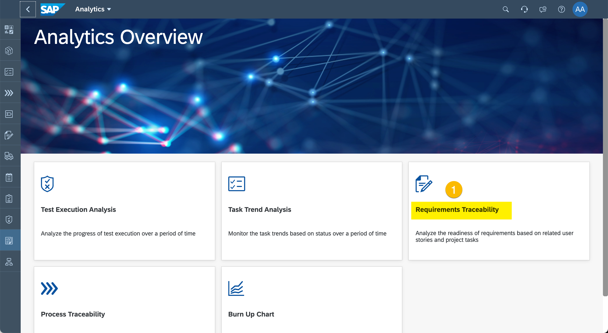
  (1) Click "Requirements Traceability".

2. Check Requirements Status agains User Story Status
  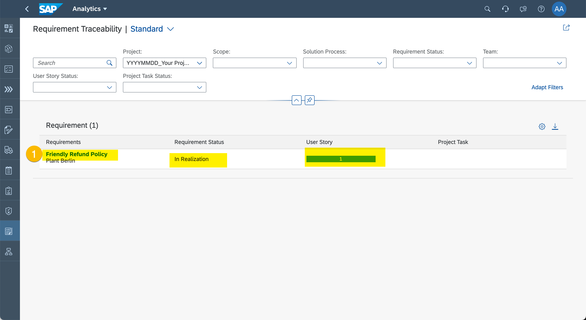
  (1) Review the Requirements Status for consistency issues and click on "Friendly Refund Policy" to resolve the issues.

3. Adjust Requirement
  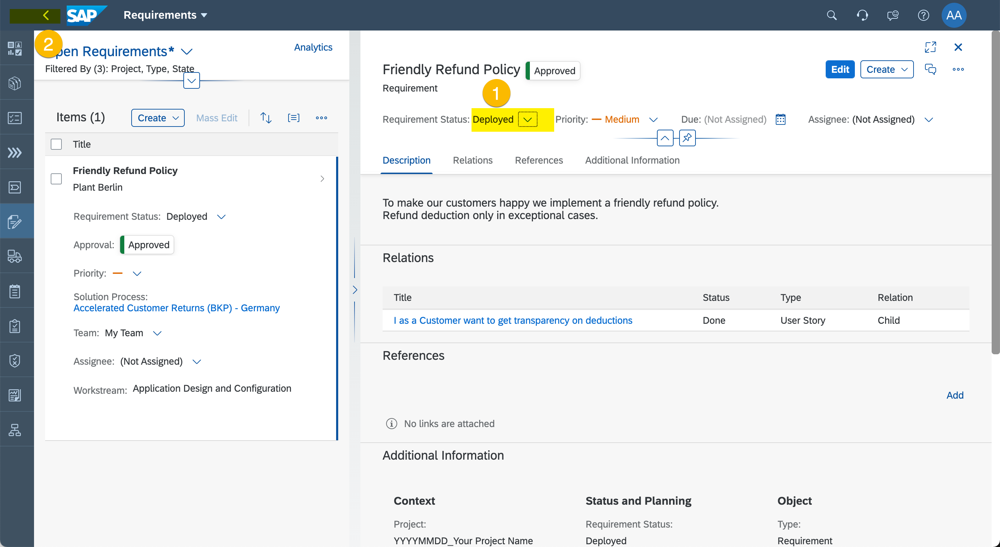
  (1) Set Requirements Status to "Deployed".
  (2) Navigate back to Requirements Traceability.

4. Review Requirement Traceability
  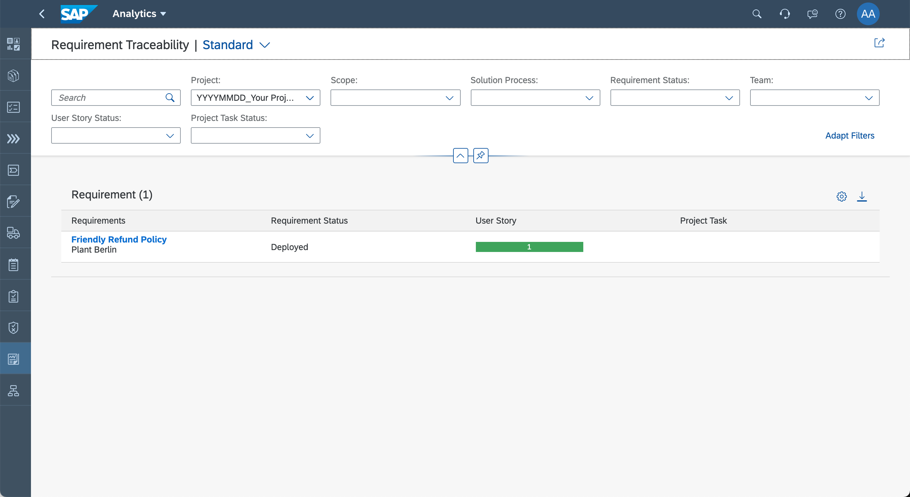
  (1) Review the Requirements Status for consistency issues. All resolved :-)

## Summary

You've now checked the project for consistency and - with the help of Traceability - you could find and resolve some inconsistencies. 

There is one last thing to do. **To keep the TechEd Demo Tenant nice and clean, please hide your project.** Next chapter shows you how.

Continue to [Exercise 9 - Conclude and Hide Your Project](../ex9/README.md)
