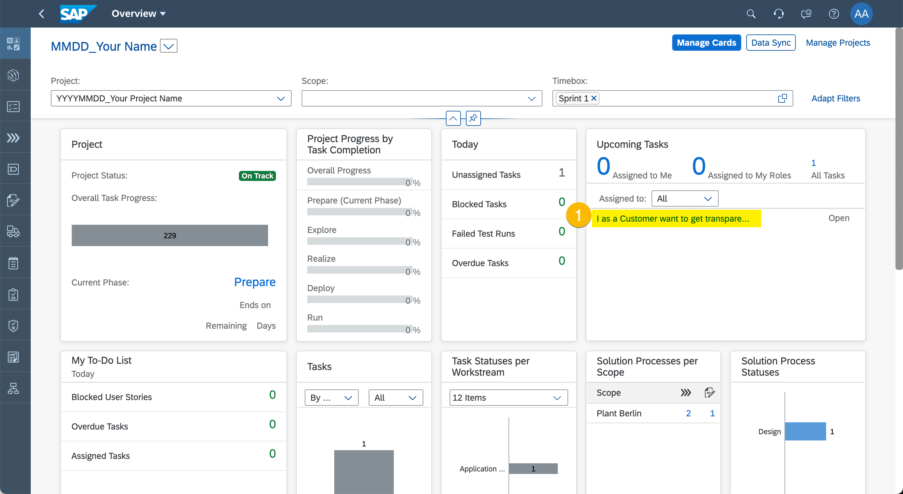

# Exercise 8 - Project Overview and Traceability

In this exercise, we will create...

## Overview Page

1. Enter "Overview Page".
  
  (1)
  (2)
  (3)

2. Adapt Filters.
  
  (1)
  (2)
  (3)
  
  (1)
  (2)
  (3)
  
  (1)
  (2)
  (3)
  
 
  
 
  

3. Navigate to User Story
  
  (1)
  
  (1)
  
  (1)
  (2)

## Analytics - Process Traceability

1. Enter "Analytics".
  
  (1)

2. Start Process Traceability
  
  (1)

3. Check Process Status agains Requirement, Test Preparation, and Test Execution
  
  (1)

4. Change Process Status
  
  (1)

5. Review Process Traceability
  
  (1)

## Analytics - Requirements Traceability

1. Start Requirements Traceability
  
  (1)

2. Check Requirements Status agains User Story Status
  
  (1)

3. Adjust Requirement
  
  (1)

4. Review Requirement Traceability
  
  (1)

## Summary

You've now ...

Continue to [Exercise 9 - Conclude and Hide Your Project](../ex9/README.md)
