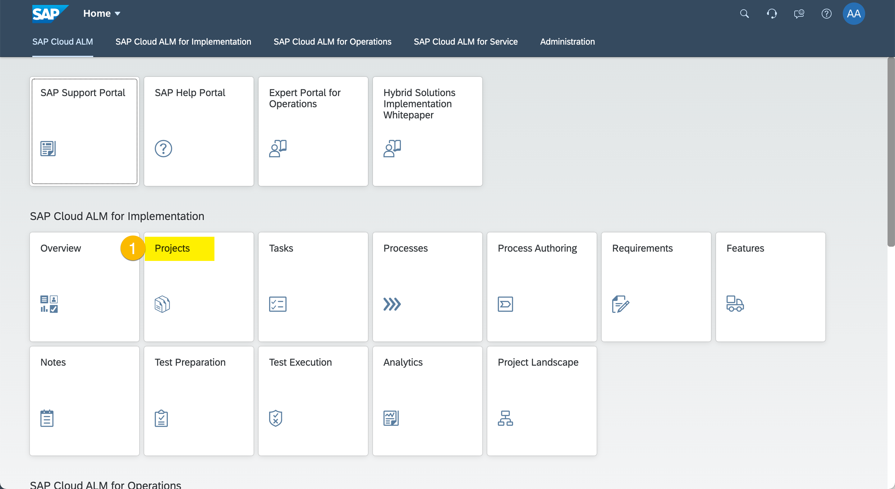

# Exercise 9 - Conclude and Hide Your Project

## Hide your Project

1. Enter Projects
  
  (1) Click "Projects".

2.	Hide Your Project
  
  (1) Find and select your project and click "Hide Project".
  (2) Note that yor Project now shows in the Tab "Hidden"

## Summary

We hope you enjoyed your little journey through an SAP implementation using SAP Cloud ALM. It was a pleasure for us. Don't be shy, just request your own customer tenant [here](https://support.sap.com/en/alm/sap-cloud-alm.html). Have fun implementing SAP solutions!

Here are some of the links you can visit to know more
[About SAP Cloud ALM](https://support.sap.com/en/alm/sap-cloud-alm.html)
[Try the Public demo System](https://support.sap.com/en/alm/demo-systems/cloud-alm-demo-system.html)
[SAP Cloud ALM Expert Portal](https://support.sap.com/en/alm/sap-cloud-alm/implementation/sap-cloud-alm-implementation-expert-portal.html)
[Blog Posts](https://blogs.sap.com/2021/01/08/understanding-project-and-task-management-in-sap-cloud-alm/)
[SAP Cloud ALM Book-Coming Soon ](https://www.sap-press.com/introducing-sap-cloud-alm-for-implementations_5477/)

Cheers, Your SAP Cloud ALM team
